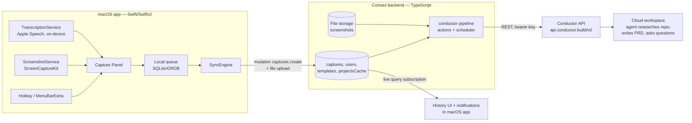

# Whistle — Technical Specification

Companion docs: [PRD](PRD.md) · [Conductor API reference](CONDUCTOR-API.md) · [Prompt template](PROMPT-TEMPLATE.md) · [Implementation plan](plans/2026-07-04-001-feat-whistle-capture-app-plan.md)

## 1. Architecture overview



Division of labor:

- **macOS app**: capture UX, permissions, on-device transcription, screenshot, local offline queue, live history via Convex subscriptions, local notifications. It never talks to the Conductor API directly and never holds the Conductor key.
- **Convex backend**: source of truth for captures/history, screenshot file storage, per-user settings + prompt template, and the entire Conductor submission pipeline as scheduled actions (survives client sleep; reusable by iOS).
- **Conductor**: workspace runtime where the agent does the research and writes the PRD.

## 2. Tech stack & rationale

| Choice | Selection | Rationale / alternatives rejected |
|---|---|---|
| macOS app | Swift 6, SwiftUI, `MenuBarExtra`; min target macOS 14 | Native TCC/permissions, lowest capture latency, shared Swift core for iOS. Electron/Tauri: weak screen-capture + mic permission story, no iOS path. |
| Transcription | `SpeechAnalyzer`/`SpeechTranscriber` (macOS 26+), fallback `SFSpeechRecognizer` with `requiresOnDeviceRecognition = true` (macOS 14–15) | Per PRD decision: private, offline, zero-setup. Both behind one `TranscriptionService` protocol so cloud STT can slot in later. See §4.1b for the session-continuation design. |
| Screenshot | `ScreenCaptureKit` `SCScreenshotManager.captureImage` | Modern API, macOS 14+; `CGWindowListCreateImage` is deprecated. |
| Global hotkey | [`KeyboardShortcuts`](https://github.com/sindresorhus/KeyboardShortcuts) SPM package | Battle-tested, includes recorder UI for settings. |
| Local persistence | GRDB (SQLite) | Offline queue, history cache, projects snapshot, last-used project. |
| Backend | Convex (TS) + Convex file storage + scheduler | Per user direction. Live queries give free history sync; scheduler powers the pipeline. |
| Swift↔Convex | [`convex-swift`](https://github.com/get-convex/convex-swift) (official) | Queries/mutations/actions + subscriptions on macOS & iOS. |
| Auth | Auth0 (OIDC) via [`convex-swift-auth0`](https://github.com/get-convex/convex-swift-auth0), Sign in with Apple + Google enabled | The documented auth path for convex-swift on Apple platforms; works identically on iOS later. **Load-bearing and unverified on sandboxed Developer-ID macOS — de-risked by a Phase-0 spike (§13 U4), which gates the auth configuration in U2.** No hard vendor commitment: the decision criterion is *easiest solid Swift integration* (user-confirmed); if the spike favors Convex Auth with a custom `AuthProvider` or another OIDC provider, switch. |
| Updates | Sparkle 2 (EdDSA-signed appcast) | Standard for non-MAS distribution. |
| Crash reporting | Sentry (opt-in) | Small, standard. |
| Web (existing Next.js) | Marketing/landing only in v1 | Repo already scaffolded; appcast + download hosting can live here. |

## 3. Repository layout (monorepo)

Restructure the existing repo (pnpm workspace file already exists):

```
whistle/
├── apps/
│   ├── macos/                 # Xcode project (Whistle.xcodeproj) + app target
│   │   ├── Whistle/           # App sources (SwiftUI)
│   │   └── WhistleTests/
│   ├── web/                   # existing Next.js app moved here (marketing, appcast, downloads)
├── packages/
│   ├── backend/               # Convex project
│   │   ├── convex/            # schema.ts, functions, pipeline actions
│   │   └── package.json
│   └── whistle-core/          # Swift package shared with future iOS app
│       └── Sources/WhistleCore/   # models, ConvexService, capture state machine, template rendering (client-side preview)
├── docs/                      # these documents + docs/plans/
├── pnpm-workspace.yaml        # packages: apps/web, packages/backend
└── package.json
```

## 4. macOS app design

### 4.1 Modules (all in `apps/macos/Whistle/` unless noted)

| Module | Responsibility |
|---|---|
| `WhistleApp.swift` + `StatusItemController` | App lifecycle, launch-at-login (`SMAppService`), and a custom `NSStatusItem` (not SwiftUI `MenuBarExtra`, which can't cleanly split left/right click): **left-click starts capture** and shows the panel anchored beneath the icon; right-click pops an `NSMenu` (History, Settings, Check for Updates, Quit). |
| `CapturePanelController` | A **non-activating** floating `NSPanel` (style includes `.nonactivatingPanel`) with `canBecomeKey` overridden to `true` — the Spotlight pattern: the panel takes key status and accepts typing *without* activating the app or deactivating the user's frontmost app. `level: .floating`, closes on submit/Esc. Hosts SwiftUI `CaptureView`. **Fallback** (only if SwiftUI focus/first-responder quirks inside a non-activating panel prove intractable during implementation): an activating panel that records `NSWorkspace.shared.frontmostApplication` before showing and re-activates it on dismiss — never leave the user dumped in a different app. |
| `CaptureView` (SwiftUI) | Slim header (History + Settings icon buttons — the panel is the app's home surface), live transcript editor, notes field, screenshot thumbnail (removable), project picker, submit. |
| `CaptureViewModel` | Orchestrates: on open → `ScreenshotService.capture()` (already taken pre-panel), `TranscriptionService.start()`; on submit → build `CaptureDraft`, hand to `CaptureStore`, close panel. |
| `ScreenshotService` | `SCShareableContent` → display under mouse cursor → `SCScreenshotManager.captureImage` → downscale to max 2000 px long edge, JPEG q0.8 (keeps uploads <1 MB and well under model image limits). Returns `nil` gracefully when TCC denied. |
| `TranscriptionService` (protocol) | `start() -> AsyncStream<TranscriptUpdate>`, `stop()`. Impl A: `SpeechAnalyzerTranscriber` (macOS 26+). Impl B: `LegacySpeechTranscriber` (`SFSpeechRecognizer`, on-device required). Factory picks at runtime via `#available`. Audio via `AVAudioEngine` input tap; no audio persisted. Session-continuation design in §4.1b. |
| `CaptureStore` (in `WhistleCore`) | GRDB-backed store: `pending_captures` queue + screenshot temp files, history cache, **projects snapshot** (refreshed whenever `projects.list` yields; enables the picker offline), and `last_used_project_id` (kept in GRDB, not UserDefaults, so WhistleCore stays testable and iOS-portable). Local states: `draft → queued → syncing → synced / syncFailed`. Emits AsyncSequence updates for UI. |
| `SyncEngine` (in `WhistleCore`) | Drains queue when online: upload screenshot (Convex `generateUploadUrl` → HTTP POST → storageId), then `captures.create` mutation. Retries with backoff; `NWPathMonitor` for connectivity. `syncFailed` surfaces a **local** retry affordance (re-run sync) — distinct from the server-side `captures.retry`. |
| `ConvexService` (in `WhistleCore`) | Wraps `ConvexClientWithAuth` (Auth0). Typed wrappers for every query/mutation/action in §7. Subscriptions: `captures.listRecent`, `projects.list`. |
| `HistoryWindow` | Full history (recent first): search, status chips per §4.4, questions, deep-link buttons, screenshot preview, delete-screenshot. Opened from the panel's history icon or the right-click menu. |
| `NotificationService` | `UNUserNotificationCenter`; fires on capture status transitions observed via subscription (`ready`, `readyUnverified`, `failed`). Routing uses `errorCode` (§5): `auth` → open Settings → API key; otherwise deep link / retry. |
| `OnboardingWindow` | Wizard per PRD F5.1. Permission checks: mic (`AVCaptureDevice.authorizationStatus`), speech (`SFSpeechRecognizer.authorizationStatus`), screen (`CGPreflightScreenCaptureAccess()` / `CGRequestScreenCaptureAccess()`). Speech-model step is per-OS — see §4.1b. |
| `SettingsWindow` | Per PRD F5.2. Hotkey recorder (KeyboardShortcuts UI), template editor (plain-text with variable legend + preview via `TemplatePreview`), API key replace (calls `settings.setConductorKey` then `conductor.validateKey`). |

### 4.1b Transcription design (the hard part, specified)

**Session continuation.** On-device `SFSpeechRecognizer` tasks finalize on silence endpointing and degrade or terminate on long sessions; continuous multi-minute dictation therefore requires *task cycling with segment stitching*:

- The service maintains `committedTranscript: String` (immutable, finalized segments joined with a single space) plus `liveSegment: String` (the current task's volatile hypothesis).
- When a recognition task reports `isFinal` (endpointing) or errors out mid-session, the service appends the final text to `committedTranscript` and immediately starts a fresh `SFSpeechRecognitionTask` on the same running audio tap. The audio engine never stops between segments.
- The UI binds to `committedTranscript + " " + liveSegment`; only the live segment re-renders. After `stop()`, the whole text becomes an ordinary editable string.
- `SpeechAnalyzerTranscriber` (macOS 26+) supports long-form sessions natively (volatile + finalized results); it implements the same `TranscriptUpdate` contract without artificial cycling.

**Model availability & download (per-OS, handled in onboarding):**

- macOS 14–15: `SFSpeechRecognizer.supportsOnDeviceRecognition` — there is **no programmatic download**; if unsupported, onboarding shows a guided step to System Settings → Keyboard → Dictation (enabling it downloads the model) with a re-check button. Until then the panel runs type-only.
- macOS 26+: `SpeechAnalyzer`/`AssetInventory` supports in-app asset download; onboarding requests and shows progress inline.

### 4.2 Capture latency budget (trigger → usable panel < 300 ms)

1. Hotkey handler: capture screenshot **first** (async, ~50–150 ms) but don't block panel display on it — thumbnail fades in when ready.
2. Panel show + first responder: immediate.
3. `TranscriptionService.start()`: audio engine prewarmed at app launch (engine built, tap ready, not running) so start is ~50 ms. Speech model availability checked at launch and resolved during onboarding (§4.1b).

### 4.3 Entitlements & Info.plist

- App Sandbox **on**: `com.apple.security.device.audio-input`, `com.apple.security.network.client`, Sparkle XPC services.
- `NSMicrophoneUsageDescription`, `NSSpeechRecognitionUsageDescription`.
- Screen recording has no usage string: onboarding calls `CGRequestScreenCaptureAccess()` and deep-links to System Settings → Privacy → Screen & System Audio Recording; app detects grant via `CGPreflightScreenCaptureAccess()` polling (note: grant may require app relaunch — onboarding handles with a "Relaunch now" button). macOS 15+ shows periodic re-authorization prompts for screen capture; treat a revoked grant as the "permission missing" degrade path, never a crash.

### 4.4 Status presentation (client mapping)

The displayed status (History window rows; in-flight changes surface via notifications — there is no persistent status menu) merges the local (GRDB) state pre-sync and the server record post-sync, keyed by `clientId`. Once a server record exists, it is the source of truth.

| Local state | Server status | Chip | Affordance |
|---|---|---|---|
| `queued` (offline) | — | Waiting for network | automatic |
| `queued`/`syncing` (online) | — | Queued | — |
| `syncFailed` | — | Sync failed | local Retry (re-run SyncEngine) |
| `synced` | `queued` | Queued | — |
| `synced` | `creating` / `sending` | Creating workspace | — |
| `synced` | `agentWorking` | Agent working | open deepLink |
| `synced` | `ready` | Ready (+N questions) | open deepLink |
| `synced` | `readyUnverified` | Sent — agent status unknown | open deepLink |
| `synced` | `failed` + `errorCode: "auth"` | Auth error | open Settings → API key |
| `synced` | `failed` (other) | Failed: userMessage | server Retry (`captures.retry`) |

## 5. Data model (Convex `schema.ts`)

```ts
export default defineSchema({
  users: defineTable({
    authSubject: v.string(),          // Auth0 sub
    email: v.optional(v.string()),
    createdAt: v.number(),
  }).index("by_subject", ["authSubject"]),

  settings: defineTable({
    userId: v.id("users"),
    conductorApiKey: v.optional(v.string()),   // sensitive; never returned unmasked (see §9)
    defaultProjectId: v.optional(v.string()),
    agent: v.string(),                         // "claude" | "codex" | "cursor"; default "claude"
    model: v.optional(v.string()),
    screenshotsEnabled: v.boolean(),
  }).index("by_user", ["userId"]),

  promptTemplates: defineTable({
    userId: v.id("users"),
    body: v.string(),                 // template with {{variables}}
    isCustomized: v.boolean(),
    updatedAt: v.number(),
  }).index("by_user", ["userId"]),

  captures: defineTable({
    userId: v.id("users"),
    clientId: v.string(),             // UUID minted on device — idempotency key for offline retry,
                                      // Conductor messageId, and workspace-name tag
    transcript: v.string(),
    notes: v.string(),
    screenshotId: v.optional(v.id("_storage")),
    projectId: v.string(),            // Conductor project id
    projectName: v.string(),
    agent: v.string(),
    model: v.optional(v.string()),
    capturedAt: v.number(),
    // pipeline
    status: v.union(
      v.literal("queued"), v.literal("creating"), v.literal("sending"),
      v.literal("agentWorking"), v.literal("ready"),
      v.literal("readyUnverified"),   // sent OK but agent completion never confirmed (watch deadline)
      v.literal("failed")),
    errorCode: v.optional(v.union(
      v.literal("auth"),              // 401/403 — terminal, route user to Settings
      v.literal("workspaceSetup"),    // Conductor reported workspace/session error — retryable
      v.literal("network"),           // exhausted transient retries — retryable
      v.literal("stalled"),           // watchdog fired — retryable
      v.literal("unknown"))),
    error: v.optional(v.string()),    // Conductor StructuredError.userMessage or local description
    attempt: v.number(),
    workspaceId: v.optional(v.string()),
    workspaceName: v.optional(v.string()),  // generated server-side, see §6 naming
    sessionId: v.optional(v.string()),
    deepLink: v.optional(v.string()),
    messageSentAt: v.optional(v.number()),
    clarifyingQuestions: v.optional(v.array(v.string())),
    agentSummary: v.optional(v.string()),
  })
    .index("by_user_time", ["userId", "capturedAt"])
    .index("by_client", ["userId", "clientId"]),

  projectsCache: defineTable({
    userId: v.id("users"),
    projects: v.array(v.object({ id: v.string(), name: v.string(), gitRemote: v.string() })),
    fetchedAt: v.number(),
  }).index("by_user", ["userId"]),
});
```

## 6. Server-side pipeline (Convex actions + scheduler)

State machine on `captures.status`:

```
queued → creating → sending → agentWorking → ready
   │         │          │           ├──────→ readyUnverified   (watch deadline hit)
   └─────────┴──────────┴───────────┴──────→ failed            (terminal, retryable via captures.retry)
```

Design rules that apply to every action below:

- **Idempotent by construction.** Every step checks recorded state before acting; re-running any action is always safe.
- **Never die silently.** Every scheduled action wraps its body in try/catch; a caught error either transitions the capture or reschedules the same action — it never simply stops. A capture can therefore only leave the in-flight states via `ready`, `readyUnverified`, or `failed`.
- **Watchdog backstop.** `captures.create` schedules `pipeline.watchdog` at +90 min; if the capture is still in `queued/creating/sending/agentWorking` when it fires, it patches `failed` with `errorCode: "stalled"` (retryable). No capture can be stranded in flight past the watchdog.
- **Error classification** lives in one `conductorFetch` helper: 401/403 → `auth` (terminal); 5xx / network / `StructuredError.retryable: true` → transient (retry with backoff); other 4xx → `workspaceSetup` (terminal for this attempt, user-retryable). It surfaces `StructuredError.userMessage` into `captures.error`.

**Workspace naming (server-side).** `workspaceName = "idea: " + firstMeaningfulWords(notes || transcript, 6) + " #" + clientId.slice(0, 6)`; falls back to `"idea: screenshot capture <YYYY-MM-DD>"` for screenshot-only captures. The clientId tag exists for orphan adoption (below). Naming happens in the pipeline, not the app, so iOS inherits it; the result is stored on `captures.workspaceName`.

`captures.create` (mutation) — validates auth, dedupes on `(userId, clientId)` (returns existing id — safe offline re-sync), inserts with `status: "queued"`, schedules `pipeline.submit` at +0 and `pipeline.watchdog` at +90 min.

`pipeline.submit` (internal action):
1. Load capture + settings + template; `storage.getUrl(screenshotId)` if present. Missing API key → `failed`/`auth`.
2. Render prompt (literal `{{var}}` substitution; §8).
3. **Ensure workspace** — only if `capture.workspaceId == null`:
   a. *Orphan adoption:* `GET /v0/projects/{projectId}/workspaces` and search names for `#<clientId.slice(0,6)>`. If found (a previous run created the workspace but died before patching), adopt it: `GET /v0/workspaces/{id}/sessions` → first session's id. This closes the create-then-crash window; `POST /v0/workspaces` itself has no idempotency key.
   b. Otherwise `POST /v0/workspaces` `{ projectId, name: workspaceName, agent, model? }` → `{ workspaceId, sessionId, deepLink }`.
   c. Patch ids + `status: "creating"` immediately (before anything else can fail).
4. **Send the prompt** (`status: "sending"`):
   a. *Dedupe guard before any (re)send:* `GET /v0/sessions/{sessionId}/messages` and check for our `messageId == clientId`; if present, skip sending (we cannot assume Conductor dedupes on `messageId` — unknown #6 in [CONDUCTOR-API.md](CONDUCTOR-API.md)).
   b. `POST /v0/sessions/{sessionId}/messages` `{ message, messageId: clientId }`. Response `state ∈ queued|sent` — both are success (spec implies messages queue during workspace init; verified in U4).
   c. If the send fails with a not-ready-shaped 4xx: hand off to `pipeline.awaitWorkspaceReady` (below) instead of looping in-action.
5. Patch `status: "agentWorking"`, `messageSentAt`, schedule `pipeline.watch` at +30 s.

Transient failure anywhere in 3–4: if `attempt < 5`, patch `attempt + 1` and reschedule `pipeline.submit` with backoff (1, 4, 10, 20 min); else `failed`/`network`. Because step 3 is guarded by `workspaceId == null` plus orphan adoption, retries never duplicate workspaces; because step 4a re-checks the session's messages, retries never duplicate the prompt.

`pipeline.awaitWorkspaceReady` (internal action, self-rescheduling — **not** an in-action poll loop; Convex actions have a ~10 min runtime ceiling):
- `GET /v0/workspaces/{workspaceId}/status`. `ready` → jump back into `pipeline.submit` (its guards skip straight to the send). `initializing`/`updating` → reschedule self at +20 s (backing off to +60 s), carrying `pollCount`; give up after ~15 min of polls → `failed`/`workspaceSetup` with the status endpoint's `errorMessage` if any. Errors: same always-reschedule-until-deadline rule.

`pipeline.watch` (internal action, self-rescheduling):
- Entire body in try/catch; a thrown error **reschedules the watch** (it never strands the capture) until the watch deadline (60 min after `messageSentAt`).
- `GET /v0/sessions/{sessionId}/status`:
  - `working` → reschedule at +30 s, backing off to +2 min.
  - `error` → `failed`/`workspaceSetup` with `errorMessage`.
  - `idle` → **verify the agent actually ran** before declaring ready: fetch `GET /v0/sessions/{sessionId}/messages` and require ≥1 agent-typed message with `sessionIndex` **after** our own message (`id`/`messageId == clientId`). `idle` with no agent reply means the queued message hasn't started (workspace may still be initializing — cross-check `GET /v0/workspaces/{id}/status` and treat `initializing` as still-working) → reschedule. With an agent reply present: extract summary (first non-empty line) and clarifying questions (numbered lines `^\d+[\.\)]` or `?`-terminated bullets in the final section — dumb, safe heuristics), patch `status: "ready"`.
- Deadline (60 min) reached without confirmation → `status: "readyUnverified"` (the workspace exists and the prompt was sent; notification copy says "agent status unknown — open in Conductor"). This is deliberately **not** `ready`: F4.1's success notification only fires for verified `ready`.

`pipeline.watchdog` (internal action): see backstop rule above.

`captures.retry` (mutation) — allowed from `failed` and `readyUnverified`; resets `attempt` and `errorCode`, patches `queued`, schedules `pipeline.submit` + a fresh watchdog. All idempotency guards above make retry safe at any prior progress point.

## 7. Convex function surface (client contract)

| Function | Type | Purpose |
|---|---|---|
| `users.ensure` | mutation | Upsert user from auth identity on first login. |
| `settings.get` / `settings.update` | query/mutation | Settings; `conductorApiKey` returned only as `hasKey: bool` + last-4. |
| `settings.setConductorKey` | mutation | Store key. |
| `conductor.validateKey` | action | `GET /v0/projects` with the stored (or passed) key → ok/error; also refreshes `projectsCache`. |
| `projects.list` | query (subscribed) | Cached projects; client persists the latest yield into GRDB for offline picker use. |
| `conductor.refreshProjects` | action | Refresh cache; called when stale (>1 h) or on picker open. |
| `templates.get` / `templates.update` / `templates.reset` | query/mutations | Prompt template (default seeded on first get). |
| `files.generateUploadUrl` | mutation | For screenshot upload from the app. |
| `captures.create` | mutation | See §6. |
| `captures.listRecent` | query (subscribed) | Recent N with status — drives History recents + notification transitions. |
| `captures.list` / `captures.get` | query | History window. |
| `captures.retry` | mutation | See §6. |
| `captures.deleteScreenshot` | mutation | Deletes `_storage` file, clears field. |

The app never holds the Conductor key; project listing therefore goes through the backend cache.

## 8. Prompt rendering

Template variables (contract shared between backend renderer and settings-UI legend):

`{{transcript}}`, `{{notes}}`, `{{screenshot_url}}` (empty string when none), `{{captured_at_iso}}`, `{{project_name}}`, `{{workspace_name}}`.

Renderer: literal string replacement, no logic. Conditional screenshot block handled with `{{#if screenshot_url}}...{{/if}}` — the **only** supported conditional; implement with a 10-line regex, not a template engine. Default template body lives in `packages/backend/convex/defaultTemplate.ts` (source of truth) and is reproduced in [PROMPT-TEMPLATE.md](PROMPT-TEMPLATE.md).

## 9. Security & privacy notes

- **Conductor API key** lives in the Convex DB (required for server-side pipeline). Convex encrypts at rest; key is never sent to clients (masked accessor only); all functions enforce `ctx.auth` row-ownership. Document the tradeoff in-product.
- **Screenshot URLs** from `storage.getUrl()` are unguessable but unauthenticated — necessary so the workspace agent can `curl` them. Mitigations: user can remove screenshots pre-submit and delete post-submit; global off switch; onboarding disclosure.
- **Auth**: Auth0 OIDC; Convex validates JWTs (standard convex-swift-auth0 setup). Apple + Google connections enabled; Sign in with Apple satisfies Apple-ecosystem expectations for the future iOS app. Verified by the Phase-0 spike before anything is built on it.
- **Transcripts/notes** are user content in Convex; deleting a capture deletes its file storage object.
- No secrets in the macOS app binary. Sparkle appcast signed (EdDSA); DMG notarized.

## 10. Distribution & CI

- **Signing**: Developer ID Application cert; hardened runtime; `xcrun notarytool` + staple in CI.
- **CI (GitHub Actions)**: macOS runner — SwiftLint, `xcodebuild test`, release job builds/signs/notarizes DMG, generates Sparkle appcast entry, uploads to GitHub Releases; `apps/web` serves the appcast XML + download page. Separate job: `npx convex deploy` for `packages/backend` and Next.js deploy.
- **Versioning**: semver; Sparkle feed keyed off GitHub Releases assets.

## 11. Testing strategy

- **WhistleCore (Swift)**: unit tests for capture state machine, queue drain/retry, template preview rendering, transcript segment-stitching (per §4.1b: finalized-segment append, mid-segment restart, empty segments), status-mapping table (§4.4). No UI tests in v1 beyond a smoke test that the panel appears.
- **Backend (TS)**: `convex-test` unit tests for every function; pipeline tests with a **mocked Conductor server** (fixtures from [CONDUCTOR-API.md](CONDUCTOR-API.md) schemas) covering: happy path; message-queued-during-init; awaitWorkspaceReady handoff; retryable 5xx → backoff → success; terminal auth failure; **submit re-run after workspace created (no duplicate workspace)**; **orphan adoption after create-then-crash**; **send re-run with message already present (no duplicate message)**; **watch survives a throwing status poll**; **idle-with-no-agent-message does not mark ready**; watch deadline → `readyUnverified`; watchdog rescue of a stalled capture; questions extraction.
- **Integration script**: `packages/backend/scripts/e2e-conductor.ts` — runs the real pipeline against a real Conductor key + scratch repo (manual, gated by env var). This is one half of the Phase-0 proof; the auth spike (U4) is the other.
- **Manual QA checklist**: permissions matrix (each of mic/speech/screen denied), offline capture, lid-close-after-submit, macOS 14 vs 26 transcription paths, long-dictation segment stitching.

## 12. iOS forward-compatibility (design constraints honored now)

- All submission logic (including workspace naming) server-side → iOS reuses it untouched.
- `WhistleCore` is a cross-platform Swift package: no AppKit imports (models, ConvexService, CaptureStore compile for iOS; ScreenshotService/TranscriptionService live in the mac app target, behind protocols defined in core).
- Capture inputs are already nullable/optional (screenshot optional) → iOS share-extension captures (image from share sheet, text, dictation via iOS Speech) fit the same `captures.create` contract.
- Auth0 + convex-swift both support iOS.

## 13. Implementation units (summary)

The authoritative, fully-detailed execution plan (per-unit goals, requirement traces, file lists, test scenarios, verification) is **[docs/plans/2026-07-04-001-feat-whistle-capture-app-plan.md](plans/2026-07-04-001-feat-whistle-capture-app-plan.md)** — hand that to the implementing model. Summary of units and sequencing:

| Unit | Scope | Depends on |
|---|---|---|
| U1 | Monorepo restructure | — |
| U2 | Convex backend foundation (schema, users, settings, templates, files) | U1, U4 (auth spike outcome) |
| U3 | Conductor client + pipeline (submit / awaitWorkspaceReady / watch / watchdog / retry) | U2 |
| U4 | **Phase-0 proofs**: `e2e-conductor.ts` against the real API (verifies unknowns #1–#6 in CONDUCTOR-API.md) **and** the Auth0+convex-swift sandboxed-macOS auth spike | U1 (can start immediately) |
| U5 | WhistleCore package (models, CaptureStore incl. projects snapshot + last-used, SyncEngine, ConvexService, TemplatePreview) | U2 |
| U6 | macOS app shell + auth | U5 |
| U7 | Screenshot + transcription services (incl. §4.1b session continuation) | U6 |
| U8 | Capture panel UX (non-activating panel, picker, hotkey) | U7 |
| U9 | History, status mapping (§4.4), notifications | U8, U3 |
| U10 | Onboarding + settings | U9 |
| U11 | Distribution (signing, notarization, Sparkle, CI) | U10 |
| U12 | Polish pass against the PRD error/edge table | U11 |

## 14. Risks

| Risk | Likelihood | Impact | Mitigation |
|---|---|---|---|
| Conductor API is `experimental` (per OpenAPI `x-conductor-stability`) and may change | Med | High | Isolate all calls in `conductorClient.ts`; pin fixtures; e2e script re-runnable to detect drift. |
| Conductor doesn't dedupe on `messageId` | Med | Med | Pipeline never relies on it — pre-send message check (§6 step 4a); verified in U4. |
| Messages can't be sent during workspace init | Med | Low | `awaitWorkspaceReady` fallback specified (§6). |
| Auth0 + convex-swift on sandboxed Developer-ID macOS fails | Med | High | Phase-0 spike (U4) before U2 auth config; fallback providers named (§2). |
| On-device speech accuracy on jargon | Med | Med | Transcript is editable pre-submit; prompt tells the agent transcripts may contain mis-hearings; cloud STT slot behind protocol later. |
| Long-dictation task cycling glitches (dropped words at segment boundaries) | Med | Med | §4.1b design + dedicated stitching tests; 5-min soft cap per PRD. |
| Screen-recording TCC friction (relaunch requirement; macOS 15 periodic re-prompts) | High | Med | Onboarding handles explicitly; capture degrades gracefully to no-screenshot; revocation re-detected at each capture. |
| `SpeechAnalyzer` API availability differences across macOS 26 point releases | Low | Med | Legacy path is fully supported fallback on all versions. |
| Convex file URLs unauthenticated | Certain | Low-Med | Product mitigations per §9; revisit with signed/expiring URLs or an authenticated proxy if Conductor adds image upload. |
