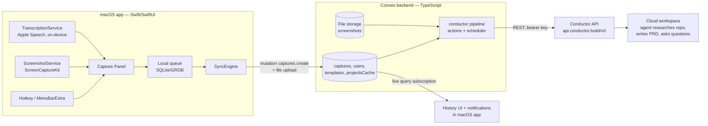

# Whistle — Technical Specification

Companion docs: [PRD](PRD.md) · [Conductor API reference](CONDUCTOR-API.md) · [Prompt template](PROMPT-TEMPLATE.md) · [Implementation plan](plans/2026-07-04-001-feat-whistle-capture-app-plan.md)

## 1. Architecture overview



Division of labor:

- **macOS app**: capture UX, permissions, on-device transcription, screenshot, local offline queue, live history via Convex subscriptions, local notifications. It never talks to the Conductor API directly and never holds the Conductor key.
- **Convex backend**: source of truth for captures/history, screenshot file storage, per-user settings + prompt template, and the entire Conductor submission pipeline as scheduled actions (survives client sleep; reusable by iOS).
- **Conductor**: workspace runtime where the agent does the research and writes the PRD.

## 2. Tech stack & rationale

| Choice | Selection | Rationale / alternatives rejected |
|---|---|---|
| macOS app | Swift toolchain 6 / **language mode 5** (see §4.1), SwiftUI, `MenuBarExtra`; min target macOS 14 | Native TCC/permissions, lowest capture latency, shared Swift core for iOS. Electron/Tauri: weak screen-capture + mic permission story, no iOS path. |
| Transcription | `SpeechAnalyzer`/`SpeechTranscriber` (macOS 26+), fallback `SFSpeechRecognizer` with `requiresOnDeviceRecognition = true` (macOS 14–15) | Per PRD decision: private, offline, zero-setup. Both behind one `TranscriptionService` protocol so cloud STT can slot in later. See §4.1b for the session-continuation design. `LegacySpeechTranscriber` is the tested shipping path (§2a); `SpeechAnalyzerTranscriber` compiles behind `#available` and is exercised against a fake. |
| Screenshot | `ScreenCaptureKit` `SCScreenshotManager.captureImage` | Modern API, macOS 14+; `CGWindowListCreateImage` is deprecated. |
| Global hotkey | [`KeyboardShortcuts`](https://github.com/sindresorhus/KeyboardShortcuts) SPM package | Battle-tested, includes recorder UI for settings. |
| Local persistence | GRDB (SQLite) | Offline queue, history cache, projects snapshot, last-used project. |
| Backend | Convex (TS) + Convex file storage + scheduler | Per user direction. Live queries give free history sync; scheduler powers the pipeline. |
| Swift↔Convex | [`convex-swift`](https://github.com/get-convex/convex-swift) (official) | Queries/mutations/actions + subscriptions on macOS & iOS. |
| Auth | Auth0 (OIDC) via [`convex-swift-auth0`](https://github.com/get-convex/convex-swift-auth0), Sign in with Apple + Google enabled | The documented auth path for convex-swift on Apple platforms; works identically on iOS later. The architecture and seam are final; **the one-shot build itself targets the seam, not a live tenant** — see §2a and §13 U4/U6 for the mock-first sequencing. No hard vendor commitment: the decision criterion is *easiest solid Swift integration* (user-confirmed); real Auth0 login is verified post-run (MANUAL-QA), and if that verification favors Convex Auth with a custom `AuthProvider` or another OIDC provider, switch — the provider sits behind `ConvexService`'s own protocol either way. |
| Updates | Sparkle 2 (EdDSA-signed appcast) | Standard for non-MAS distribution. |
| Crash reporting | Sentry (opt-in) | Small, standard; no-ops cleanly when `SENTRY_DSN` is absent (§2a, §10). |
| Web (existing Next.js) | Marketing/landing only in v1 | Repo already scaffolded; appcast + download hosting can live here. **This is not the Next.js you know** — read `node_modules/next/dist/docs/` before touching `apps/web` code (see `AGENTS.md`); this applies to the appcast route work in §10 too. |

## 2a. Execution environment & conventions

These are verified facts about the machine and accounts the one-shot implementation runs on. Treat them as ground truth; do not re-discover or second-guess them.

**Host & toolchains.**
- Host: macOS 15.7.3, Apple Silicon.
- Xcode 26.3 is installed at `/Applications/Xcode.app`, is selected via `xcode-select`, and its license is accepted. It carries the macOS 26 SDK (and iOS SDK — see §13 U5's iOS-compile check).
- `packages/whistle-core` has no AppKit dependency and a macOS 14 minimum; it builds and tests with plain `swift build` / `swift test` — no Xcode project needed.
- Every app-target build or test (the `apps/macos/Whistle` target, `WhistleTests`) uses `xcodebuild`, never plain `swift build`. Scripts and CI steps must set `DEVELOPER_DIR=/Applications/Xcode.app/Contents/Developer` explicitly (don't rely on ambient `xcode-select` state) so builds are robust to environment drift.
- Codesigning identity "Developer ID Application: Nabeel HYATT (73JZ8HJ79F)" is present in the keychain and pre-authorized for unattended (non-interactive) use.

**Secrets.** `.env.local` at the repo root (a gitignored symlink shared across Conductor workspaces) holds:
- `CONDUCTOR_API_KEY` — validated, usable immediately.
- `CONDUCTOR_SCRATCH_PROJECT_ID=11dd0481-a2ba-4bcd-86c3-8cbe309a6f5f` — project "ttl", reserved for throwaway e2e workspaces. Every workspace the e2e script creates must be named `whistle-e2e-*` and archived via `POST /v0/workspaces/{id}/archive` when the script finishes (§13 U4, CONDUCTOR-API.md).
- `NOTARY_KEY_ID` / `NOTARY_ISSUER_ID` / `NOTARY_KEY_PATH` — an App Store Connect API key for `notarytool`.
- Absent: `SENTRY_DSN`, Auth0 tenant values, GitHub Actions secrets. Code paths gated on these must degrade cleanly (skip + log a reason) rather than fail — see §2a Definition of done and §10.

**Convex.** The Convex CLI is already logged in on this machine, and a project already exists: team `nabeelo`, project `whistle`, deployment `grandiose-alpaca-243`. U2 must target this deployment non-interactively — via `.env.local` / `CONVEX_DEPLOYMENT` plus `npx convex dev --once` — and must never invoke interactive `convex dev` project configuration.

**Definition of done (autonomous one-shot).** Because this build runs unattended, "done" for the run as a whole — and, unless a unit says otherwise, for each unit — means:
1. All automated suites pass: `swift test` for `whistle-core`; `xcodebuild test` (with fakes/mocks for anything requiring hardware, TCC, or a live network) for the app target; the vitest/convex-test matrix for the backend.
2. The app builds, signs, and launches: a smoke check that the process starts and the status item registers.
3. A DMG artifact is produced.
4. Every verification step that requires a human at the keyboard (real permission grants, real dictation, real timing on a physical Mac, a live multi-day walk, a clean-machine install, a version-to-version update) is compiled — verbatim, not summarized — into a generated `docs/MANUAL-QA.md` checklist for the human to execute afterward.

This redefines several unit verifications from earlier drafts of this plan; the authoritative per-unit versions are in the plan document (§13 points to it), but the shape is:
- **U6** ("runs signed-in") → compiles, and mock-auth tests are green; real login is a `MANUAL-QA.md` item.
- **U7** (dictation correctness on macOS 14 and macOS 26) → fake-recognizer unit tests green; real dictation on both OS versions becomes `MANUAL-QA.md` items (this host is 15.7.3 — neither 14 nor 26 is available to test against directly).
- **U8** (300 ms trigger-to-interactive timing; frontmost-app-preserved check) → both become `MANUAL-QA.md` items.
- **U9** (live end-to-end walk through Queued→Ready in the History window) → `MANUAL-QA.md` item.
- **U10** (fresh-account 5-minute activation) → `MANUAL-QA.md` item.
- **U11** (Gatekeeper clean-machine install; Sparkle vN→vN+1 update) → `MANUAL-QA.md` items.
- **U12** → becomes "fix everything the automated suites catch, then author the complete `docs/MANUAL-QA.md` from the PRD error/edge table" (single-OS: the host), rather than a two-OS live walk.

## 3. Repository layout (monorepo)

Restructure the existing repo (pnpm workspace file already exists):

```
whistle/
├── apps/
│   ├── macos/                 # Xcode project (Whistle.xcodeproj, generated — see §3a) + app target
│   │   ├── project.yml        # XcodeGen spec — checked in; source of truth for the .xcodeproj
│   │   ├── Whistle/           # App sources (SwiftUI)
│   │   └── WhistleTests/
│   ├── web/                   # existing Next.js app moved here (marketing, appcast, downloads)
├── packages/
│   ├── backend/               # Convex project
│   │   ├── convex/            # schema.ts, functions, pipeline actions
│   │   └── package.json
│   └── whistle-core/          # Swift package shared with future iOS app
│       └── Sources/WhistleCore/   # models, ConvexService, capture state machine, template rendering (client-side preview)
├── docs/                      # these documents + docs/plans/
├── pnpm-workspace.yaml        # packages: apps/web, packages/backend — the `packages:` key does not exist yet in the current scaffold and must be added, not edited (see §13 U1)
└── package.json
```

### 3a. Xcode project generation

`Whistle.xcodeproj` is never hand-authored and never committed as raw `.pbxproj` edits — both are unreliable to generate/maintain by hand. Instead:

- **XcodeGen** (`brew install xcodegen`; Homebrew is present on this host) generates the project from a checked-in spec.
- `apps/macos/project.yml` declares: the `Whistle` app target (deployment target macOS 14, entitlements per §4.3, Info.plist usage strings, SPM package dependencies — local `WhistleCore` via a relative path, `KeyboardShortcuts`, `Sparkle`, `convex-swift`, and the Auth0 auth package per §2/§6 pinning) and the `WhistleTests` test target.
- `xcodegen generate` is a scripted step (run from `apps/macos/`, or wrapped in a Makefile/shell script) — it must run before any `xcodebuild` invocation in a fresh checkout, and after any edit to `project.yml`.
- `project.yml` is part of U1's checked-in structure and U6's file list (§13).

## 4. macOS app design

### 4.1 Modules (all in `apps/macos/Whistle/` unless noted)

**Concurrency.** The app target builds with **Swift language mode 5** (`SWIFT_VERSION = 5` in `project.yml`, §3a) even though the toolchain is Swift 6 — full Swift 6 strict concurrency checking is not worth the implementation cost it adds across audio-tap callbacks, speech delegates, AppKit main-actor rules, and GRDB access in a one-shot build. Isolation is instead handled explicitly per module: UI controllers (`StatusItemController`, `CapturePanelController`, `HistoryWindow`, `OnboardingWindow`, `SettingsWindow`, and their view models) carry a targeted `@MainActor`; `TranscriptionService` is implemented as an **actor** that owns the `AVAudioEngine` tap and recognition task state, so audio callbacks and `stop()`/`start()` calls serialize safely without manual locking; all `CaptureStore` access goes through GRDB's own serial queue rather than a second ad hoc actor.

| Module | Responsibility |
|---|---|
| `WhistleApp.swift` + `StatusItemController` | App lifecycle, launch-at-login (`SMAppService`), and a custom `NSStatusItem` (not SwiftUI `MenuBarExtra`, which can't cleanly split left/right click): **left-click starts capture** and shows the panel anchored beneath the icon; right-click pops an `NSMenu` (History, Settings, Check for Updates, Quit). The icon also renders a **ready-indicator** (dot/badge) whenever ≥1 capture is `ready` and unopened (`openedAt` unset, §5); the indicator clears the moment the count of ready-and-unopened captures reaches zero (i.e. on open, per `captures.markOpened`, §7). |
| `CapturePanelController` | **Both panel modes ship in v1.** Default: a **non-activating** floating `NSPanel` (style includes `.nonactivatingPanel`) with `canBecomeKey` overridden to `true` — the Spotlight pattern: the panel takes key status and accepts typing *without* activating the app or deactivating the user's frontmost app. `level: .floating`, closes on submit/Esc. Hosts SwiftUI `CaptureView` via an `NSHostingView`, with an explicit `makeFirstResponder` call on the hosting view after `orderFront` (the known-good pattern for getting SwiftUI text focus inside a key-capable panel). **Fallback mode** (built alongside the default, not a contingency to build later): an activating panel that records `NSWorkspace.shared.frontmostApplication` before showing and re-activates it on dismiss — never leave the user dumped in a different app. A `UserDefaults` debug flag selects which mode is active at launch. One-shot acceptance for this unit is both modes compiling and `CaptureViewModel` tests passing under either; **which mode feels right in practice is a `MANUAL-QA.md` line item** (flip the flag, compare). |
| `CaptureView` (SwiftUI) | Slim header (History + Settings icon buttons — the panel is the app's home surface), live transcript editor, notes field, screenshot thumbnail (removable), project picker, submit. |
| `CaptureViewModel` | Orchestrates: on open → `ScreenshotService.capture()` (already taken pre-panel), `TranscriptionService.start()`; on submit → build `CaptureDraft`, hand to `CaptureStore`, close panel. Also the entry point for **"Duplicate as new capture"** (§4.1 HistoryWindow row): accepts an optional pre-fill (`transcript`, `notes`, `screenshot`) and a request to focus the project picker on open, minting a fresh `clientId` — this is not a distinct code path, just a different set of initial arguments into the same panel/store flow. |
| `ScreenshotService` | `SCShareableContent` → display under mouse cursor → `SCScreenshotManager.captureImage` → downscale to max 2000 px long edge, JPEG q0.8 (keeps uploads <1 MB and well under model image limits). Returns `nil` gracefully when TCC denied. |
| `TranscriptionService` (protocol) | `start() -> AsyncStream<TranscriptUpdate>`, `stop()`. Impl A: `SpeechAnalyzerTranscriber` (macOS 26+) — compiles behind `#available` against the macOS 26 SDK present in Xcode 26.3, exercised in tests against a fake recognizer; tagged **runtime-unverified — requires a macOS 26 machine** in `MANUAL-QA.md`, since this host cannot run it. Impl B: `LegacySpeechTranscriber` (`SFSpeechRecognizer`, on-device required) — the **tested shipping path** for v1. Factory picks at runtime via `#available`. Audio via `AVAudioEngine` input tap; no audio persisted. Session-continuation design in §4.1b. |
| `CaptureStore` (in `WhistleCore`) | GRDB-backed store: `pending_captures` queue + screenshot temp files, history cache, **projects snapshot** (refreshed whenever `projects.list` yields; enables the picker offline), and `last_used_project_id` (kept in GRDB, not UserDefaults, so WhistleCore stays testable and iOS-portable). Local states: `draft → queued → syncing → synced / syncFailed`. Emits AsyncSequence updates for UI. |
| `SyncEngine` (in `WhistleCore`) | Drains queue when online: upload screenshot (Convex `generateUploadUrl` → HTTP POST → storageId), then `captures.create` mutation. Retries with backoff; `NWPathMonitor` for connectivity. `syncFailed` surfaces a **local** retry affordance (re-run sync) — distinct from the server-side `captures.retry`. |
| `ConvexService` (in `WhistleCore`) | Wraps the app's own auth-provider protocol (implementations: `Auth0AuthProvider` behind `ConvexClientWithAuth`, and `MockAuthProvider` for tests/one-shot smoke — see §2a/§13 U6). Typed wrappers for every query/mutation/action in §7. Subscriptions: `captures.listRecent`, `projects.list`. All convex-swift / convex-swift-auth0 usage stays behind this one file's protocol, so any API drift from their beta 0.x status is contained here (see §13 U5 pinning note). |
| `HistoryWindow` | Full history (recent first): search, status chips per §4.4, questions, deep-link buttons, screenshot preview, delete-screenshot. Opened from the panel's history icon or the right-click menu. Rows with `openedAt` set are visually de-emphasized (opened rows recede — e.g. reduced-emphasis text/background) and can be **archived/dismissed** (patches `archivedAt`, §5/§7); archived rows leave the default view (available via a filter, not deleted). Each row also offers **"Duplicate as new capture"**: pre-fills transcript/notes/screenshot into a fresh capture panel (via `CaptureViewModel`, above) with the project picker focused, minting a new `clientId` — the recovery path for "submitted to the wrong project" or "content came out garbled." Opening a row's deep link calls `captures.markOpened` (§7), which patches `openedAt` and clears the row from the ready-indicator count. |
| `NotificationService` | `UNUserNotificationCenter`; fires on capture status transitions observed via subscription (`ready`, `readyUnverified`, `failed`). Routing uses `errorCode` (§5): `auth` → open Settings → API key; otherwise deep link / retry. Opening a notification's deep link also calls `captures.markOpened`, same as opening from HistoryWindow. |
| `OnboardingWindow` | Wizard per PRD F5.1 (reordered for time-to-first-value). Permission checks: mic (`AVCaptureDevice.authorizationStatus`), speech (`SFSpeechRecognizer.authorizationStatus`) are combined into a **single** step with per-permission status rows, not two explainer screens; screen recording (`CGPreflightScreenCaptureAccess()` / `CGRequestScreenCaptureAccess()`) is **not** part of the gating wizard — it's offered as a post-first-capture upsell ("Add screenshots to future captures"). Speech-model step is per-OS — see §4.1b. Wizard progress (current step, completed permission grants) persists across app relaunch — required because the screen-recording grant can itself force a relaunch, and now that grant sits outside the gated flow, any relaunch mid-wizard must not lose earlier progress. |
| `SettingsWindow` | Per PRD F5.2. Hotkey recorder (KeyboardShortcuts UI), template editor (plain-text with variable legend + preview via `TemplatePreview`; **lints for a missing "How to end" contract block** and warns inline, since question extraction — §6 `pipeline.watch` — silently breaks without it), API key replace (calls `settings.setConductorKey` then `conductor.validateKey`). |

### 4.1b Transcription design (the hard part, specified)

**Session continuation.** On-device `SFSpeechRecognizer` tasks finalize on silence endpointing and degrade or terminate on long sessions; continuous multi-minute dictation therefore requires *task cycling with segment stitching*:

- The service maintains `committedTranscript: String` (immutable, finalized segments joined with a single space) plus `liveSegment: String` (the current task's volatile hypothesis).
- When a recognition task reports `isFinal` (endpointing) or errors out mid-session, the service appends the final text to `committedTranscript` and immediately starts a fresh `SFSpeechRecognitionTask` on the same running audio tap. The audio engine never stops between segments.
- The UI binds to `committedTranscript + " " + liveSegment`; only the live segment re-renders. After `stop()`, the whole text becomes an ordinary editable string.
- `SpeechAnalyzerTranscriber` (macOS 26+) supports long-form sessions natively (volatile + finalized results); it implements the same `TranscriptUpdate` contract without artificial cycling.

**Model availability & download (per-OS, handled in onboarding):**

- macOS 14–15: `SFSpeechRecognizer.supportsOnDeviceRecognition` — there is **no programmatic download**; if unsupported, onboarding shows a guided step to System Settings → Keyboard → Dictation (enabling it downloads the model) with a re-check button. Until then the panel runs type-only.
- macOS 26+: `SpeechAnalyzer`/`AssetInventory` supports in-app asset download; onboarding requests and shows progress inline.

### 4.2 Capture latency budget (trigger → usable panel < 300 ms)

1. Hotkey handler: capture screenshot **first** (async, ~50–150 ms) but don't block panel display on it — thumbnail fades in when ready.
2. Panel show + first responder: immediate.
3. `TranscriptionService.start()`: audio engine prewarmed at app launch (engine built, tap ready, not running) so start is ~50 ms. Speech model availability checked at launch and resolved during onboarding (§4.1b).

### 4.3 Entitlements & Info.plist

- App Sandbox **on**: `com.apple.security.device.audio-input`, `com.apple.security.network.client`, Sparkle XPC services.
- `NSMicrophoneUsageDescription`, `NSSpeechRecognitionUsageDescription`.
- Screen recording has no usage string: onboarding calls `CGRequestScreenCaptureAccess()` and deep-links to System Settings → Privacy → Screen & System Audio Recording; app detects grant via `CGPreflightScreenCaptureAccess()` polling (note: grant may require app relaunch — onboarding handles with a "Relaunch now" button). macOS 15+ shows periodic re-authorization prompts for screen capture; treat a revoked grant as the "permission missing" degrade path, never a crash.

### 4.4 Status presentation (client mapping)

The displayed status (History window rows; in-flight changes surface via notifications — there is no persistent status menu) merges the local (GRDB) state pre-sync and the server record post-sync, keyed by `clientId`. Once a server record exists, it is the source of truth.

| Local state | Server status | Chip | Affordance |
|---|---|---|---|
| `queued` (offline) | — | Waiting for network | automatic |
| `queued`/`syncing` (online) | — | Queued | — |
| `syncFailed` | — | Sync failed | local Retry (re-run SyncEngine) |
| `synced` | `queued` | Queued | — |
| `synced` | `creating` / `sending` | Creating workspace | — |
| `synced` | `agentWorking` | Agent working | open deepLink |
| `synced` | `ready` | Ready (+N questions) | open deepLink |
| `synced` | `readyUnverified` | Sent — agent status unknown | open deepLink |
| `synced` | `failed` + `errorCode: "auth"` | Auth error | open Settings → API key |
| `synced` | `failed` (other) | Failed: userMessage | server Retry (`captures.retry`) |

## 5. Data model (Convex `schema.ts`)

```ts
export default defineSchema({
  users: defineTable({
    authSubject: v.string(),          // Auth0 sub
    email: v.optional(v.string()),
    createdAt: v.number(),
  }).index("by_subject", ["authSubject"]),

  settings: defineTable({
    userId: v.id("users"),
    conductorApiKey: v.optional(v.string()),   // sensitive; never returned unmasked (see §9)
    defaultProjectId: v.optional(v.string()),
    agent: v.string(),                         // "claude" | "codex" | "cursor"; default "claude"
    model: v.optional(v.string()),
    screenshotsEnabled: v.boolean(),
  }).index("by_user", ["userId"]),

  promptTemplates: defineTable({
    userId: v.id("users"),
    body: v.string(),                 // template with {{variables}}
    isCustomized: v.boolean(),
    updatedAt: v.number(),
  }).index("by_user", ["userId"]),

  captures: defineTable({
    userId: v.id("users"),
    clientId: v.string(),             // UUID minted on device — idempotency key for offline retry,
                                      // Conductor messageId, and workspace-name tag
    transcript: v.string(),
    notes: v.string(),
    screenshotId: v.optional(v.id("_storage")),
    projectId: v.string(),            // Conductor project id
    projectName: v.string(),
    agent: v.string(),
    model: v.optional(v.string()),
    capturedAt: v.number(),
    // pipeline
    status: v.union(
      v.literal("queued"), v.literal("creating"), v.literal("sending"),
      v.literal("agentWorking"), v.literal("ready"),
      v.literal("readyUnverified"),   // sent OK but agent completion never confirmed (watch deadline)
      v.literal("failed")),
    errorCode: v.optional(v.union(
      v.literal("auth"),              // 401/403 — terminal, route user to Settings
      v.literal("workspaceSetup"),    // Conductor reported workspace/session error — retryable
      v.literal("network"),           // exhausted transient retries — retryable
      v.literal("stalled"),           // watchdog fired — retryable
      v.literal("unknown"))),
    error: v.optional(v.string()),    // Conductor StructuredError.userMessage or local description
    attempt: v.number(),
    workspaceId: v.optional(v.string()),
    workspaceName: v.optional(v.string()),  // generated server-side, see §6 naming
    sessionId: v.optional(v.string()),
    deepLink: v.optional(v.string()),
    messageSentAt: v.optional(v.number()),
    clarifyingQuestions: v.optional(v.array(v.string())),
    agentSummary: v.optional(v.string()),
    // ready-state lifecycle (drives the PRD north-star metric — see PRD Success metrics)
    openedAt: v.optional(v.number()),      // patched when the user opens this capture's deep link from Whistle
    archivedAt: v.optional(v.number()),    // patched when the user dismisses/archives the row from History
  })
    .index("by_user_time", ["userId", "capturedAt"])
    .index("by_client", ["userId", "clientId"]),

  projectsCache: defineTable({
    userId: v.id("users"),
    projects: v.array(v.object({ id: v.string(), name: v.string(), gitRemote: v.string() })),
    fetchedAt: v.number(),
  }).index("by_user", ["userId"]),
});
```

## 6. Server-side pipeline (Convex actions + scheduler)

State machine on `captures.status`:

```
queued → creating → sending → agentWorking → ready
   │         │          │           ├──────→ readyUnverified   (watch deadline hit)
   └─────────┴──────────┴───────────┴──────→ failed            (terminal, retryable via captures.retry)
```

Design rules that apply to every action below:

- **Idempotent by construction.** Every step checks recorded state before acting; re-running any action is always safe.
- **Never die silently.** Every scheduled action wraps its body in try/catch; a caught error either transitions the capture or reschedules the same action — it never simply stops. A capture can therefore only leave the in-flight states via `ready`, `readyUnverified`, or `failed`.
- **Watchdog backstop.** `captures.create` schedules `pipeline.watchdog` at +90 min; if the capture is still in `queued/creating/sending/agentWorking` when it fires, it patches `failed` with `errorCode: "stalled"` (retryable). No capture can be stranded in flight past the watchdog.
- **Error classification** lives in one `conductorFetch` helper: 401/403 → `auth` (terminal); 5xx / network / `StructuredError.retryable: true` → transient (retry with backoff); other 4xx → `workspaceSetup` (terminal for this attempt, user-retryable). It surfaces `StructuredError.userMessage` into `captures.error`. One send-specific special case (U4 finding, step 4b' below): a 500 carrying Postgres code `23505` on the messages endpoint means our own prior send already succeeded — this is classified separately and never treated as a retryable transient failure.

**Workspace naming (server-side).** `workspaceName = title + " #" + clientId.slice(0, 6)`, where `title` is a 3-5 word, noun-first title from a Claude Haiku call (`titleGenerator.ts`, `generateWorkspaceTitle`) over the transcript/notes/project name — this call never throws and returns `null` on any failure (missing `ANTHROPIC_API_KEY`, non-200, network error, ~10s timeout), in which case `title` falls back to `firstMeaningfulWords(notes || transcript, 6)`, and further to `"Screenshot capture <YYYY-MM-DD>"` for screenshot-only captures. The clientId tag exists for orphan adoption (below) and is always present regardless of which naming path produced the title. Naming happens in the pipeline, not the app, so iOS inherits it; the result is stored on `captures.workspaceName` (so a title is generated at most once per capture — retries reuse the persisted name).

`captures.create` (mutation) — validates auth, dedupes on `(userId, clientId)` (returns existing id — safe offline re-sync), inserts with `status: "queued"`, schedules `pipeline.submit` at +0 and `pipeline.watchdog` at +90 min.

`pipeline.submit` (internal action):
1. Load capture + settings + template; `storage.getUrl(screenshotId)` if present. Missing API key → `failed`/`auth`.
2. Render prompt (literal `{{var}}` substitution; §8).
3. **Ensure workspace** — only if `capture.workspaceId == null`:
   a. *Orphan adoption:* `GET /v0/projects/{projectId}/workspaces` and search names for `#<clientId.slice(0,6)>`. If found (a previous run created the workspace but died before patching), adopt it: `GET /v0/workspaces/{id}/sessions` → first session's id. This closes the create-then-crash window; `POST /v0/workspaces` itself has no idempotency key.
   b. Otherwise `POST /v0/workspaces` `{ projectId, name: workspaceName, agent, model? }` → `{ workspaceId, sessionId, deepLink }`.
   c. Patch ids + `status: "creating"` immediately (before anything else can fail).
4. **Send the prompt** (`status: "sending"`):
   a. *Dedupe guard before any (re)send:* `GET /v0/sessions/{sessionId}/messages` and check for our `clientId` across the legacy top-level `id`/`messageId` fields and the live nested `content.id`/`content.turnId` fields, case-insensitively; if present, skip sending (Conductor does not dedupe on `messageId` — re-sending hard-fails; see 4b'). Note this check can legitimately see an empty list right after a real successful send (U4 finding: a queued/sent message isn't necessarily listed yet) — safe only in combination with 4b'.
   b. `POST /v0/sessions/{sessionId}/messages` `{ message, messageId: clientId }`. Response `state ∈ queued|sent` — both are success (spec implies messages queue during workspace init; verified live in U4, including at `lifecycleStep: "preparing"`/`"building_snapshot"`).
   b'. *Duplicate-send special case (U4 finding):* a send-shaped failure with HTTP 500 and Conductor error `code: "23505"` (a raw Postgres unique-constraint violation) means **our own prior send already succeeded** — Conductor does not dedupe `messageId`, it hard-fails instead. This is never classified as a retryable transient error; on this specific shape, re-run the 4a message-list check to confirm, then proceed to step 5 without resending. Any other send-shaped 500 still follows the normal transient-retry path below.
   c. If the send fails with a not-ready-shaped 4xx: hand off to `pipeline.awaitWorkspaceReady` (below) instead of looping in-action.
5. Patch `status: "agentWorking"`, `messageSentAt`, schedule `pipeline.watch` at +30 s.

Transient failure anywhere in 3–4: if `attempt < 5`, patch `attempt + 1` and reschedule `pipeline.submit` with backoff (1, 4, 10, 20 min); else `failed`/`network`. Because step 3 is guarded by `workspaceId == null` plus orphan adoption, retries never duplicate workspaces; because step 4a re-checks the session's messages, retries never duplicate the prompt.

`pipeline.awaitWorkspaceReady` (internal action, self-rescheduling — **not** an in-action poll loop; Convex actions have a ~10 min runtime ceiling):
- `GET /v0/workspaces/{workspaceId}/status`. `ready` → jump back into `pipeline.submit` (its guards skip straight to the send). `deleted`/`archived` → `failed`/`workspaceSetup` immediately with the status endpoint's `errorMessage` (U4 finding: a workspace whose initialization fails auto-transitions to `deleted` rather than parking in an error state, and any message queued during init is silently dropped — never poll through this as if it were still initializing). `initializing`/`updating` → reschedule self at +20 s (backing off to +60 s), carrying `pollCount`; give up after ~15 min of polls → `failed`/`workspaceSetup` with the status endpoint's `errorMessage` if any. Errors: same always-reschedule-until-deadline rule.

`pipeline.watch` (internal action, self-rescheduling):
- Entire body in try/catch; a thrown error **reschedules the watch** (it never strands the capture) until the watch deadline (60 min after `messageSentAt`).
- `GET /v0/sessions/{sessionId}/status`:
  - `working` → reschedule at +30 s, backing off to +2 min.
  - `error` → `failed`/`workspaceSetup` with `errorMessage`.
  - `idle` → **verify the agent actually ran** before declaring ready: fetch `GET /v0/sessions/{sessionId}/messages` and require a text-bearing agent event correlated to our client UUID. The live API lowercases that UUID and nests it under the user event's `content.id`/`content.turnId` and agent events' `content.userMessageId`/`content.turnId`; assistant text is under `content.rawPayload.message.content[].text`. `idle` with no correlated agent reply means the queued message hasn't started (workspace may still be initializing — cross-check `GET /v0/workspaces/{id}/status` and treat `initializing` as still-working) → reschedule. **This workspace cross-check is load-bearing, not optional** (U4 finding): a session reads `idle` — never `error` — for the entire time its workspace is initializing, and keeps reading `idle` after a failed init auto-transitions the workspace to `deleted`; `idle` alone proves nothing. If the cross-check finds the workspace `deleted` (or carrying an `errorMessage`), stop polling and patch `failed`/`workspaceSetup` immediately — do **not** let this drift forward to `readyUnverified` at the watch deadline, since the message was silently dropped and no agent will ever reply. With an agent reply present: extract summary (first non-empty line) and clarifying questions (numbered lines `^\d+[\.\)]` or `?`-terminated bullets in the final section — dumb, safe heuristics), patch `status: "ready"`.
- Deadline (60 min) reached without confirmation → `status: "readyUnverified"` (the workspace exists and the prompt was sent; notification copy says "agent status unknown — open in Conductor"). This is deliberately **not** `ready`: F4.1's success notification only fires for verified `ready`.

`pipeline.watchdog` (internal action): see backstop rule above.

`captures.retry` (mutation) — allowed from `failed` and `readyUnverified`; resets `attempt` and `errorCode`, patches `queued`, schedules `pipeline.submit` + a fresh watchdog. All idempotency guards above make retry safe at any prior progress point.

## 7. Convex function surface (client contract)

| Function | Type | Purpose |
|---|---|---|
| `users.ensure` | mutation | Upsert user from auth identity on first login. |
| `settings.get` / `settings.update` | query/mutation | Settings; `conductorApiKey` returned only as `hasKey: bool` + last-4. |
| `settings.setConductorKey` | mutation | Store key. |
| `conductor.validateKey` | action | `GET /v0/projects` with the stored (or passed) key → ok/error; also refreshes `projectsCache`. |
| `projects.list` | query (subscribed) | Cached projects; client persists the latest yield into GRDB for offline picker use. |
| `conductor.refreshProjects` | action | Refresh cache; called when stale (>1 h) or on picker open. |
| `templates.get` / `templates.update` / `templates.reset` | query/mutations | Prompt template (default seeded on first get). |
| `files.generateUploadUrl` | mutation | For screenshot upload from the app. |
| `captures.create` | mutation | See §6. |
| `captures.listRecent` | query (subscribed) | Recent N with status — drives History recents + notification transitions. |
| `captures.list` / `captures.get` | query | History window. |
| `captures.retry` | mutation | See §6. |
| `captures.deleteScreenshot` | mutation | Deletes `_storage` file, clears field. |
| `captures.markOpened` | mutation | Patches `openedAt = Date.now()` if unset (idempotent — first open wins). Called when the user opens a capture's deep link, from either the History row or a notification. Drives the ready-indicator badge (§4.1) and the PRD north-star metric (Success metrics). |
| `captures.archive` | mutation | Patches `archivedAt = Date.now()`. Called from the History row's archive/dismiss affordance. Archived rows are excluded from `captures.listRecent`/`captures.list`'s default view but remain queryable (a filter, not a delete) — distinct from `POST /v0/workspaces/{id}/archive` on the Conductor side (CONDUCTOR-API.md), which is a separate, later Phase 1.1 action on the workspace itself. |

The app never holds the Conductor key; project listing therefore goes through the backend cache.

## 8. Prompt rendering

Template variables (contract shared between backend renderer and settings-UI legend):

`{{transcript}}`, `{{notes}}`, `{{screenshot_url}}` (empty string when none), `{{captured_at_iso}}`, `{{project_name}}`, `{{workspace_name}}`.

Renderer: literal string replacement, no logic. Conditional screenshot block handled with `{{#if screenshot_url}}...{{/if}}` — the **only** supported conditional; implement with a 10-line regex, not a template engine. Default template body lives in `packages/backend/convex/defaultTemplate.ts` (source of truth) and is reproduced in [PROMPT-TEMPLATE.md](PROMPT-TEMPLATE.md).

## 9. Security & privacy notes

- **Conductor API key** lives in the Convex DB (required for server-side pipeline). Convex encrypts at rest; key is never sent to clients (masked accessor only); all functions enforce `ctx.auth` row-ownership. Document the tradeoff in-product.
- **Screenshot URLs** from `storage.getUrl()` are unguessable but unauthenticated — necessary so the workspace agent can `curl` them. Mitigations: user can remove screenshots pre-submit and delete post-submit; global off switch; onboarding disclosure.
- **Auth**: Auth0 OIDC; Convex validates JWTs (standard convex-swift-auth0 setup). Apple + Google connections enabled; Sign in with Apple satisfies Apple-ecosystem expectations for the future iOS app. The one-shot build itself runs against env/xcconfig placeholder Auth0 config plus a `MockAuthProvider` implementing the same provider protocol (§4.1 `ConvexService`, §2a) — used by all automated tests and the smoke run. Real Auth0 tenant provisioning and a real `ASWebAuthenticationSession` login round-trip inside the sandboxed signed app are post-run human steps, listed in `SECRETS.md` and `docs/MANUAL-QA.md`.
- **Transcripts/notes** are user content in Convex; deleting a capture deletes its file storage object.
- No secrets in the macOS app binary. Sparkle appcast signed (EdDSA); DMG notarized when notarization credentials are present (§10).

## 10. Distribution & CI

- **Signing**: Developer ID Application cert (present in the keychain, §2a); hardened runtime; `xcrun notarytool` + staple when notarization credentials are available.
- **Notarization is env-gated end to end.** `NOTARY_KEY_ID`/`NOTARY_ISSUER_ID`/`NOTARY_KEY_PATH` are provisioned in `.env.local` for this run (§2a), so U11 attempts a full local notarize + staple. Every credentialed step in the packaging script and in `release.yml` must check for its required env var/secret first and **skip cleanly with a logged reason** rather than fail when it's absent — this keeps the same script correct both now (credentials present locally) and in CI (secrets not yet provisioned, see below).
- **Sparkle EdDSA keys** are generated locally during U11 (`generate_keys` from the Sparkle distribution). The public key is embedded in `Info.plist`; the private key is not committed — it must be exported as a GitHub Actions secret before `release.yml` can sign a real appcast entry.
- **CI secrets.** The GitHub repo currently has zero Actions secrets configured. U11 authors all three workflows (below) so they are correct and ready, but the release workflow's full signed/notarized/published run is necessarily deferred until secrets exist. U11 produces `SECRETS.md` at the repo root listing exactly what must be provisioned before `release.yml` can run end to end: the Developer ID cert as a base64 `.p12` + its password (for CI codesigning), the notarization API key (ASC key id/issuer/`.p8` contents), the Sparkle EdDSA private key, and `SENTRY_DSN`.
- **Sentry** initializes as a clean no-op when `SENTRY_DSN` is absent or empty (§2a) — never a startup failure or a visible error; this holds in the one-shot build (DSN absent) and continues to hold in CI/production once a DSN is provisioned.
- **CI (GitHub Actions)**: three workflows — `ci.yml` (ubuntu runner: backend vitest + typecheck + `apps/web` `next build`; macos-26 runner: `swift test`, `xcodebuild test`; on every PR — there is no SwiftLint job), `release.yml` (builds/signs the DMG, attempts notarization per the env-gating above, generates a Sparkle appcast entry, uploads to GitHub Releases), `backend-deploy.yml` (`npx convex deploy` for `packages/backend`; `apps/web` has no CI deploy workflow — it's hosted separately, see `docs/RELEASING.md`). `apps/web` serves the appcast XML + download page — **this is not the Next.js you know**; read `node_modules/next/dist/docs/` before touching `apps/web` code, per `AGENTS.md`, before making any changes here (including the appcast route).
- **Versioning**: semver; Sparkle feed keyed off GitHub Releases assets.

## 11. Testing strategy

- **WhistleCore (Swift)**: unit tests for capture state machine, queue drain/retry, template preview rendering, transcript segment-stitching (per §4.1b: finalized-segment append, mid-segment restart, empty segments), status-mapping table (§4.4). No UI tests in v1 beyond a smoke test that the panel appears. Runs with plain `swift test` (§2a) — no Xcode project needed for this package.
- **App target (Swift/Xcode)**: `xcodebuild test` against the XcodeGen-generated project (§3a), with `DEVELOPER_DIR` set explicitly (§2a). Auth-dependent tests run against `MockAuthProvider` (§9); TCC/hardware-dependent behavior (mic, speech, screen recording) is tested against fakes, with real-device verification deferred to `docs/MANUAL-QA.md`.
- **Backend (TS)**: `convex-test` unit tests for every function; pipeline tests with a **mocked Conductor server** (fixtures from [CONDUCTOR-API.md](CONDUCTOR-API.md) schemas) covering: happy path; message-queued-during-init; awaitWorkspaceReady handoff; retryable 5xx → backoff → success; terminal auth failure; **submit re-run after workspace created (no duplicate workspace)**; **orphan adoption after create-then-crash**; **send re-run with message already present (no duplicate message)**; **watch survives a throwing status poll**; **idle-with-no-agent-message does not mark ready**; watch deadline → `readyUnverified`; watchdog rescue of a stalled capture; questions extraction. Test harness, pinned exactly (§13 U3): **vitest** with the `edge-runtime` environment plus **`convex-test`**; the Conductor API is mocked via `vi.stubGlobal("fetch", ...)`; self-rescheduling scheduled actions (`pipeline.watch`, `pipeline.awaitWorkspaceReady`, `pipeline.watchdog`) are driven with `vi.useFakeTimers()` plus `t.finishInProgressScheduledFunctions()` / `t.finishAllScheduledFunctions()` rather than real sleeps. `convex-test` and `vitest` are pinned to exact versions in `packages/backend/package.json` (U2).
- **Integration script**: `packages/backend/scripts/e2e-conductor.ts` — runs the real pipeline against the real Conductor API using `CONDUCTOR_API_KEY` + `CONDUCTOR_SCRATCH_PROJECT_ID` from `.env.local` (§2a); see §13 U4 for sequencing and CONDUCTOR-API.md for the unknowns it resolves. Every workspace it creates is named `whistle-e2e-*` and archived via `POST /v0/workspaces/{id}/archive` when the script finishes.
- **`docs/MANUAL-QA.md`** (generated, not hand-maintained): the compiled list of every verification that needs a human at the keyboard — see §2a Definition of done for the full rationale and the per-unit list. Covers: permissions matrix (each of mic/speech/screen denied, on real hardware), offline capture, lid-close-after-submit, real macOS 14 vs 26 transcription paths (this host is 15.7.3 — neither is available; `SpeechAnalyzerTranscriber` is explicitly tagged runtime-unverified, §4.1), long-dictation segment stitching, the capture-panel focus-mode flag flip (§4.1), 300 ms timing, real Auth0 login, notarized Gatekeeper install, Sparkle vN→vN+1 update, and the PRD error/edge table walked on the host OS (U12).

## 12. iOS forward-compatibility (design constraints honored now)

- All submission logic (including workspace naming) server-side → iOS reuses it untouched.
- `WhistleCore` is a cross-platform Swift package: no AppKit imports (models, ConvexService, CaptureStore compile for iOS; ScreenshotService/TranscriptionService live in the mac app target, behind protocols defined in core).
- Capture inputs are already nullable/optional (screenshot optional) → iOS share-extension captures (image from share sheet, text, dictation via iOS Speech) fit the same `captures.create` contract.
- Auth0 + convex-swift both support iOS.

## 13. Implementation units (summary)

The authoritative, fully-detailed execution plan (per-unit goals, requirement traces, file lists, test scenarios, verification) is **[docs/plans/2026-07-04-001-feat-whistle-capture-app-plan.md](plans/2026-07-04-001-feat-whistle-capture-app-plan.md)** — hand that to the implementing model. Summary of units and sequencing:

| Unit | Scope | Depends on |
|---|---|---|
| U1 | Monorepo restructure | — |
| U2 | Convex backend foundation (schema, users, settings, templates, files) | U1 |
| U3 | Conductor client + pipeline (submit / awaitWorkspaceReady / watch / watchdog / retry) | U2 |
| U4 | **Phase-0 proof**: `e2e-conductor.ts` against the real API (verifies unknowns #1–#6 in CONDUCTOR-API.md) | U1 (can start immediately) |
| U5 | WhistleCore package (models, CaptureStore incl. projects snapshot + last-used, SyncEngine, ConvexService, TemplatePreview) | U2 |
| U6 | macOS app shell + mock-first auth | U5 |
| U7 | Screenshot + transcription services (incl. §4.1b session continuation) | U6 |
| U8 | Capture panel UX (both panel modes, picker, hotkey) | U7 |
| U9 | History, status mapping (§4.4), ready-lifecycle, notifications | U8, U3 |
| U10 | Onboarding + settings | U9 |
| U11 | Distribution (signing, env-gated notarization, Sparkle, CI) | U10 |
| U12 | Automated fixes + author `docs/MANUAL-QA.md` against the PRD error/edge table | U11 |

U2 and U6 no longer gate on an auth-spike outcome (§2, §14): both build directly against the Auth0/`MockAuthProvider` seam described in §2 and §9. U4 is now Conductor-e2e only — the Auth0+convex-swift auth spike is removed from the one-shot critical path and its goal (verifying a real login round-trip in the sandboxed signed app) folds into `docs/MANUAL-QA.md`.

## 14. Risks

| Risk | Likelihood | Impact | Mitigation |
|---|---|---|---|
| Conductor API is `experimental` (per OpenAPI `x-conductor-stability`) and may change | Med | High | Isolate all calls in `conductorClient.ts`; pin fixtures; e2e script re-runnable to detect drift. |
| Conductor doesn't dedupe on `messageId` | Med | Med | Pipeline never relies on it — pre-send message check (§6 step 4a); verified in U4. |
| Messages can't be sent during workspace init | Med | Low | `awaitWorkspaceReady` fallback specified (§6). |
| Auth0 + convex-swift on sandboxed Developer-ID macOS fails | Med | High | Mock-first build: the one-shot ships against `MockAuthProvider` behind the same protocol (§2, §9), so nothing in the automated build depends on Auth0 actually working; real-login verification is deferred to `docs/MANUAL-QA.md`, and the provider is swappable behind the seam (fallback providers named, §2) if that verification fails. |
| On-device speech accuracy on jargon | Med | Med | Transcript is editable pre-submit; prompt tells the agent transcripts may contain mis-hearings; cloud STT slot behind protocol later. |
| Long-dictation task cycling glitches (dropped words at segment boundaries) | Med | Med | §4.1b design + dedicated stitching tests; 5-min soft cap per PRD. |
| Screen-recording TCC friction (relaunch requirement; macOS 15 periodic re-prompts) | High | Med | Onboarding handles explicitly; capture degrades gracefully to no-screenshot; revocation re-detected at each capture. |
| `SpeechAnalyzer` API availability differences across macOS 26 point releases | Low | Med | Legacy path is fully supported fallback on all versions. |
| Convex file URLs unauthenticated | Certain | Low-Med | Product mitigations per §9; revisit with signed/expiring URLs or an authenticated proxy if Conductor adds image upload. |
