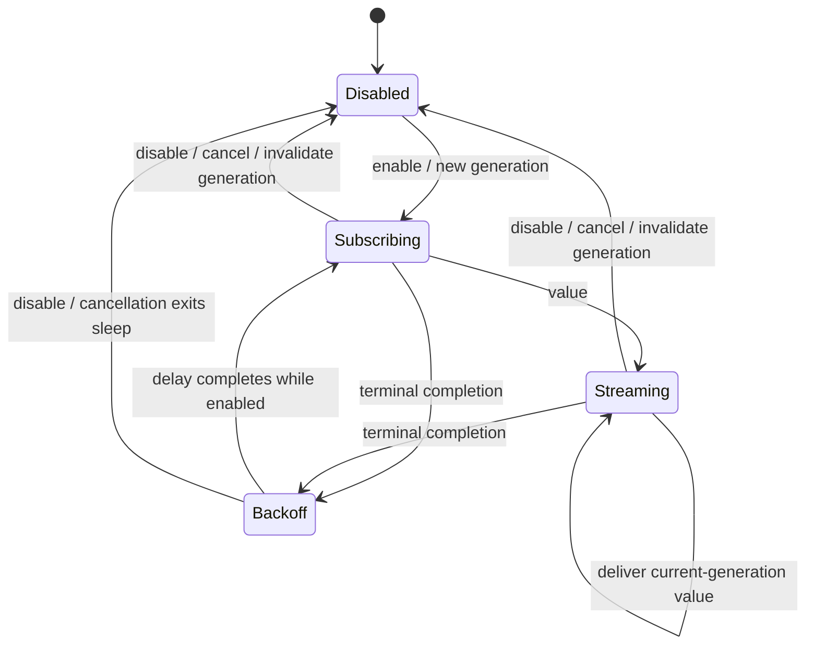

# Complete the stuck “Queued” lifecycle hotfix

## Goal Capsule

Finish PR #13 so a same-account sign-in or reauthentication reliably restores History and project updates, a terminated subscription restarts without another auth event or app relaunch, and live Conductor replies advance captures from “Queued” to the authoritative server status.

This is a focused hotfix. Amend the existing PR #13 and keep it in draft until the lifecycle work, green CI, and real-capture verification are complete; do not open a second PR or redesign account storage, Settings as a whole, Convex transport reconnection, or transcription production behavior.

## Product Contract

### Summary

The reported capture was successfully submitted: Conductor created the workspace and completed the agent session. Two reconciliation defects left Whistle showing “Queued”:

1. Authenticated streams could terminate while signed out or during reauthentication. PR #13 clears the dead task slot, but its tests manually enable the stream again. Production receives no new auth event while it remains signed in, so the stream can still stay dead.
2. The backend previously expected capture identifiers and reply text in obsolete top-level Conductor fields. The live API nests lowercase identifiers and response text under `content` and `content.rawPayload.message`.

The required correction is lifecycle ownership, not a larger account or persistence redesign.

### Requirements

- **R1 — Auth-gated subscriptions.** History and the app-wide Projects coordinator start server subscriptions only while auth is `.signedIn` and cancel them for every other auth state. History’s local pending-draft observation remains active signed out and offline.
- **R2 — Automatic terminal recovery.** If an enabled subscription stream actually terminates, it restarts after cancellation-aware capped backoff without another auth emission, manual enable call, window reopen, or relaunch.
- **R3 — One current generation.** Repeated enable is idempotent. Disable/re-enable creates a fresh generation. An old canceled task cannot deliver values, clear a newer task, or schedule another retry.
- **R4 — Fresh reauthentication.** A sign-in attempt beginning from `.reauthRequired` detaches the old Convex auth bridge before interactive login and `users.ensure`. Initial sign-in does not detach unnecessarily; explicit sign-out keeps its existing fail-closed ordering.
- **R5 — One projects subscription.** Remove Settings’ duplicate long-lived `projects.list` subscription. Settings observes `CaptureStore.projectsUpdates()` populated by the app-wide Projects coordinator.
- **R6 — Correct Conductor reconciliation.** Preserve case-insensitive nested-ID parsing, require agent output to correlate to the originating user message, extract live nested assistant text while supporting simpler text containers, and use the same ID extraction for pre-send deduplication.
- **R7 — Deterministic tests.** Lifecycle tests terminate fake streams and observe automatic recovery without manually enabling them again. Fix the unrelated transcription CI race by synchronizing the fake before asserting its task-start count; do not change production transcription behavior without separate deterministic evidence.
- **R8 — Release integrity.** Keep PR #13 in draft while any lifecycle requirement or required check is incomplete. Preserve the existing retry/idempotency and one-hour `readyUnverified` fallback, keep `MARKETING_VERSION` at 1.0.3 for PR #13, obtain green backend/WhistleCore/macOS CI, deploy the backend first, and complete one real capture without relaunching.

### Acceptance Examples

- **AE1 — Sign-in recovery.** Launch signed out with a local synced draft showing “Queued”; sign in; exactly one History stream starts and a server `ready` record replaces the local status without relaunching.
- **AE2 — Stream ends while signed in.** Finish the current fake History or Projects stream while auth remains `.signedIn`; a replacement appears after backoff without another lifecycle call.
- **AE3 — Cancellation during retry.** Disable while a stream is active or sleeping in backoff; it does not restart and late old-generation values are ignored.
- **AE4 — Rapid auth changes.** Apply `.signedIn → .reauthRequired → .signedIn`; the final state owns exactly one fresh subscriber and stale asynchronous work cannot win out of order.
- **AE5 — Reauth ordering.** Start sign-in from `.reauthRequired`; recorded calls show `detachAuth` before `usersEnsure`. Normal initial sign-in records no detach.
- **AE6 — Shared projects source.** Settings shows cached and later coordinator-persisted projects through `projectsUpdates()` while creating no `projects.list` subscriber of its own.
- **AE7 — Nested correlated reply.** A lowercase live-shape fixture with multiple agent events yields only the reply linked to our user message, advances the capture to `ready`, and extracts its summary/questions.
- **AE8 — Dedupe.** An existing nested originating user-message ID prevents a duplicate prompt and workspace.
- **AE9 — Notification stability.** A reconnect that re-yields unchanged `ready` data does not send another notification.
- **AE10 — Deterministic transcription test.** The test receives all four expected transcript updates, awaits the fake’s fourth task-start event, and passes repeatedly without a production transcriber change.
- **AE11 — Real smoke test.** A same-account user signs in and submits one capture; History shows `Queued → Creating workspace → Agent working → Ready` without relaunching, with one stable capture ID, one workspace, and one originating prompt.

### Scope Boundaries

In scope: the shared subscription lifecycle, History, Projects, removal of Settings’ duplicate projects stream, reauthentication reset, existing backend parser/dedupe work, deterministic tests, documentation, and rollout verification.

Explicitly deferred:

- User-scoping local drafts/history/projects for safe account switching. Existing captures must not be deleted or reassigned as part of this hotfix.
- Handling synced local drafts older than `captures.listRecent(limit: 100)` through pagination or per-capture lookup.
- Redesigning every Settings load/save around auth epochs.
- Moving retry into `LiveConvexService` or replacing Convex’s built-in WebSocket reconnect behavior.
- Convex schema or public API changes, Conductor API changes, and production transcription changes.

### Sources

- `docs/solutions/runtime-errors/syncengine-wedged-by-hung-convex-call.md`: recovery cannot rely on a future external trigger, and cancellation must be tested against late/non-cooperative work.
- [Convex Swift overview](https://docs.convex.dev/client/swift/overview): the process-lifetime client owns normal WebSocket reconnection.
- [`convex-swift` 0.8.1 auth source](https://github.com/get-convex/convex-swift/blob/0.8.1/Sources/ConvexMobile/ConvexMobile.swift): logout clears the auth callback; attach/login installs the auth bridge.
- Apple documentation for [task cancellation](https://developer.apple.com/documentation/swift/task/cancel()), [`AsyncStream` termination](https://developer.apple.com/documentation/swift/asyncstream/continuation/ontermination), and [cancellation-aware sleep](https://developer.apple.com/documentation/swift/task/sleep(for:tolerance:clock:)).
- PR #13 macOS CI: the transcription test received all four expected updates but observed the fake’s asynchronous `startTaskCallCount` at 3 instead of 4.

## Planning Contract

### Key Technical Decisions

- **KTD1 — Shared supervisor above `LiveConvexService`** *(session-settled: user-approved — chosen over separate History/Projects retries and transport-layer auth retry)*. Add one WhistleCore primitive that owns enabled intent, one retained task, retry backoff, and generation fencing. Convex remains responsible for normal socket reconnect.
- **KTD2 — Retry terminal completion only.** Any unexpected `AsyncStream` completion is retryable while enabled because the current bridge erases publisher failure into completion. Use capped exponential delay, retry indefinitely while enabled, and reset the delay after a successful value.
- **KTD3 — Deterministic cancellation seam.** Inject a throwing async sleeper/retry policy for tests. Production uses cancellation-aware `Task.sleep`; cancellation must exit rather than be swallowed with `try?`.
- **KTD4 — Serialize app auth effects.** Drive subscription lifecycle from `auth.$state.removeDuplicates()` only, separate error-message presentation from lifecycle side effects, and serialize the actor-isolated Projects transition so rapid auth changes cannot reorder.
- **KTD5 — Reset Convex at reauth preflight.** When `signIn()` begins in `.reauthRequired`, await `detachAuth()` before login/`users.ensure`. This avoids making the synchronous refresh-failure signal perform fire-and-forget teardown.
- **KTD6 — Store fan-out for Settings.** `ProjectsSyncCoordinator` is the sole long-lived `projects.list` owner; Settings consumes the same persisted store stream as the capture picker.
- **KTD7 — Strict reply correlation.** Preserve compatibility with simple and nested text containers, but do not accept an unrelated text-bearing agent event merely because its session index follows our user event.
- **KTD8 — Fix the fake, not the transcriber.** Add an awaitable fake observation before asserting the fourth task start. CI already proves the four production transcript updates occur.

### Lifecycle Design



The supervisor checks the captured generation before delivering a value, retrying, or clearing owner state. History retains its independent local observation. A terminal server-stream retry retains the last displayed server values; an explicit auth disable preserves PR #13’s current History behavior of clearing in-memory server rows and falling back to local drafts.

### Risks and Mitigations

- Permanent terminal failure could spin: cap exponential backoff and log retry attempt/delay.
- Canceled FFI work could finish late: generation-fence every side effect, not only task cleanup.
- Rapid auth transitions could reorder actor calls: use one serialized lifecycle coordinator/consumer rather than discarded tasks per Combine emission.
- Removing Settings’ stream could leave it stale: prove immediate cached yield and later store updates in tests.
- CI flake could be mistaken for production failure: await the fake event and stress the test without changing `LegacySpeechTranscriber`.

## Implementation Units

### U1. Add the shared subscription supervisor

**Requirements:** R1–R3, R7; AE2–AE4.

**Files:** Create `packages/whistle-core/Sources/WhistleCore/AuthenticatedSubscription.swift` and `packages/whistle-core/Tests/WhistleCoreTests/AuthenticatedSubscriptionTests.swift`.

**Approach:** Implement enabled/disabled intent, one retained supervisor task, monotonically increasing generation, stream factory, value handler, capped retry policy, and injected throwing sleeper. Log terminal completion, retry, cancellation, and first successful reconnection without payloads or credentials.

**Test scenarios:** automatic restart without another enable; repeated enable idempotency; backoff progression/reset; disable during iteration/backoff; disable/re-enable fencing; stale old value/completion suppression; teardown does not restart.

**Verification:** `swift test --package-path packages/whistle-core --filter AuthenticatedSubscriptionTests` passes without arbitrary sleeps.

### U2. Migrate Projects and remove Settings’ duplicate stream

**Requirements:** R1–R3, R5; AE2–AE4, AE6.

**Files:** Modify `packages/whistle-core/Sources/WhistleCore/ProjectsSyncCoordinator.swift`, its tests/fakes, `apps/macos/Whistle/Settings/SettingsWindow.swift`, its construction site, and affected Settings tests in `apps/macos/WhistleTests/OnboardingGatingTests.swift`.

**Dependencies:** U1.

**Approach:** Replace Projects’ task-slot lifecycle with the supervisor. Persist each yield as today. Inject `CaptureStore` into Settings and replace its direct `projectsList()` task with one `projectsUpdates()` observation. Leave the bounded, post-auth onboarding fetch explicitly outside the long-lived supervisor.

**Test scenarios:** terminal Projects stream auto-restarts; disable/backoff cancellation; store snapshot persists across retry; Settings receives initial/later store values; Settings creates zero server project subscribers.

**Verification:** targeted Projects and Settings tests pass; repository search shows one long-lived `projects.list` owner.

### U3. Migrate History and real auth-state wiring

**Requirements:** R1–R4, R7; AE1–AE5, AE9.

**Files:** Modify `apps/macos/Whistle/History/HistoryWindow.swift`, `apps/macos/Whistle/WhistleApp.swift`, `apps/macos/Whistle/AuthController.swift`, `apps/macos/WhistleTests/NotificationRoutingTests.swift`, and `apps/macos/WhistleTests/AuthControllerTests.swift`. Extract a narrow app lifecycle coordinator only if needed to make production auth wiring directly testable.

**Dependencies:** U1, U2.

**Approach:** Keep History’s local pending task independent; supervise only `capturesListRecent`. Drive owner enablement from deduplicated auth state in serialized order. Detach Convex before a reauth-origin sign-in. Preserve sign-out ordering and notification dedupe.

**Test scenarios:** signed-out local rows; sign-in authoritative replacement; automatic terminal restart; disable during active/backoff; rapid auth transitions; error-message-only changes do not restart; detach-before-ensure ordering; reconnect does not duplicate notification.

**Verification:** tests exercise the real extracted auth-state binder and never manually re-enable after stream completion.

### U4. Tighten and revalidate backend reply reconciliation

**Requirements:** R6, R8; AE7–AE8.

**Files:** Revalidate/modify `packages/backend/convex/pipeline.ts`, `packages/backend/convex/conductorClient.ts`, `packages/backend/convex/__tests__/pipeline.test.ts`, and the sanitized live fixture.

**Approach:** Keep one normalized identifier extractor for reply correlation and dedupe. Require a supported matching identifier for agent output rather than accepting unlinked later text. Preserve live nested and simple text extraction. Keep existing watcher/idempotency/fallback behavior.

**Test scenarios:** lowercase nested IDs; multiple unrelated/event-only agent messages; correlated assistant blocks; nested pre-send dedupe; idle session transitions to `ready`; retry creates no duplicate external state.

**Verification:** `pnpm --filter backend test` passes.

### U5. Make the transcription regression deterministic

**Requirements:** R7; AE10.

**Files:** Modify only the speech-recognition fake/test support adjacent to `apps/macos/WhistleTests/TranscriptStitchingTests.swift` unless deterministic evidence identifies a production bug.

**Approach:** Signal and await the fake’s fourth `startTask` observation before asserting the count. Retain all four transcript-update assertions.

**Test scenarios:** target test passes repeatedly with no sleeps and no production-source change.

**Verification:** run the target test for 25 iterations.

### U6. Verify and roll out PR #13

**Requirements:** R8; AE11.

**Files:** Update `docs/TECH-SPEC.md` lifecycle notes, retain `docs/CONDUCTOR-API.md` and fixture updates, and keep `apps/macos/project.yml` at 1.0.3.

**Dependencies:** U1–U5.

**Approach:** Mark/keep PR #13 as draft, run all gates, inspect the full PR diff for discarded/manual-restart code, and update its description. Deploy the corrected backend first, then install/distribute the rebuilt Whistle 1.0.3 and perform one real same-account capture. Only mark the PR ready after the checks and smoke test pass.

**Verification:** green local/remote checks and sanitized smoke-test evidence for AE11.

## Verification Contract

```bash
pnpm --filter backend test
swift test --package-path packages/whistle-core
cd apps/macos
xcodegen generate
xcodebuild test -project Whistle.xcodeproj -scheme Whistle -destination 'platform=macOS'
```

Repeat the targeted transcription test 25 times with Xcode test iterations. Also audit `projectsList()` and `capturesListRecent()` call sites, verify lifecycle tests do not call enable after terminal completion, and review `git diff origin/main...HEAD` for duplicate retry logic, logged secrets, production transcription workarounds, schema changes, capture deletion, or ID reminting.

Rollout order:

1. Deploy the backend parser/watch changes.
2. Confirm an eligible existing retry reconciles without another workspace/prompt where safe.
3. Install Whistle 1.0.3, sign into the same account, and submit one capture.
4. Observe AE11 without relaunching and verify one stable capture ID/workspace/prompt.

## Definition of Done

- R1–R8 and AE1–AE11 pass through deterministic tests or the real smoke test.
- History and Projects recover from terminal completion without another auth event.
- Settings owns no long-lived `projects.list` subscription.
- Reauthentication detaches the stale Convex bridge before `users.ensure`.
- Live nested correlation, extraction, pipeline transition, and dedupe tests pass.
- The transcription target passes 25 iterations without a production transcriber change.
- Backend, WhistleCore, full macOS tests, and PR #13 CI are green.
- PR #13 remains draft until the complete lifecycle correction, required checks, and smoke test pass.
- Version remains 1.0.3, backend deploys first, and the real same-account flow reaches `Ready` without duplicate external state.
- Documentation clearly defers account-storage isolation, old-history pagination, and broader Settings lifecycle redesign.
- Abandoned or duplicate lifecycle experiments are absent from the final diff.
