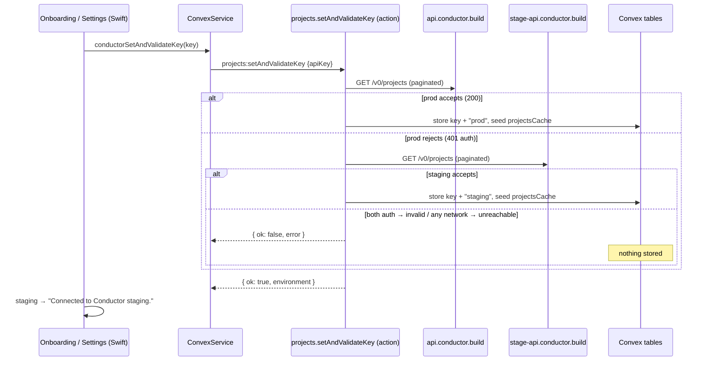

# Conductor Staging Key Support - Plan

## Goal Capsule

- **Objective:** Whistle accepts Conductor staging/alpha API keys by probing both Conductor hosts on key entry, persisting the detected environment with the key, using it for every Conductor call, and surfacing staging in the UI.
- **Authority:** This plan supersedes the originating pasted spec where they differ — the plan corrects the spec against this branch (line drift, the already-fixed Settings ordering, missing typecheck script).
- **Stop conditions:** Stop if the probe discriminator turns out unreliable (both hosts accepting the same key, or non-401 rejection envelopes) — that invalidates KTD1 and needs a design revisit, not a workaround.
- **User decision on record:** Clean break on Convex function signatures — old shipped app builds must auto-update before re-entering a key; no tolerant/deprecated args.

---

## Product Contract

### Summary

When a user pastes a Conductor API key, Whistle probes `api.conductor.build` then `stage-api.conductor.build`, atomically stores the key plus whichever environment accepted it, uses that base URL for all subsequent Conductor calls, and shows the detected environment in onboarding and Settings so staging users understand why their workspaces don't appear in the prod Conductor app.

### Problem Frame

Kaden tried Whistle with a Conductor alpha API key and it was rejected. There are exactly two Conductor API deployments — prod (`api.conductor.build`) and staging (`stage-api.conductor.build`); alpha/beta/dev desktop builds all point at staging. Keys carry no environment marker (WorkOS-minted; each Roundhouse deployment validates against its own WorkOS environment), so the environment cannot be detected from the key string — but probing is reliable: both hosts return an identical `401 {"code":"UNAUTHORIZED"}` for a wrong-environment key and `200` for a valid one (verified live). Whistle hardcodes prod in a single constant, `API_BASE` at `packages/backend/convex/conductorClient.ts:9`. All Conductor HTTP happens in the Convex backend; the Swift app never calls Conductor directly.

### Requirements

Key handling:
- R1. A staging key entered in onboarding or Settings is accepted, and every subsequent Conductor call for that user targets `stage-api.conductor.build`.
- R2. Environment is auto-detected by probing prod first, then staging — never asked of the user.
- R3. Key and detected environment are stored atomically, and only when a host accepted the key; a rejected key changes nothing (the previously working key stays in place).
- R4. Stored settings rows without an environment default to prod — existing users keep working with zero migration.

UI:
- R5. Staging is visible: onboarding success shows "Connected to Conductor staging."; Settings shows the environment next to the masked key (e.g. `••••1a2b · Staging`). Prod shows nothing extra.
- R6. Dashboard links point at `stage-app.conductor.build/users/api-keys` when the stored environment is staging (Roundhouse's own `api.` → `app.` / `stage-api.` → `stage-app.` mapping).
- R7. Error copy distinguishes a rejected key ("Conductor didn't accept that key. Check that you copied the whole key.") from unreachable hosts ("Couldn't reach Conductor. Check your connection and try again.").

Compatibility:
- R8. Prod is probed first, so probe cost lands only on key entry — never in the capture pipeline hot path.

### Scope Boundaries

- No environment picker UI — detection is automatic only.
- No per-capture or per-project environment; environment is a property of the stored key.
- Old shipped app builds (≤1.0.14) break on the key-entry flows until they update (approved clean break); their existing stored keys keep working because reads default to prod.

---

## Planning Contract

### Key Technical Decisions

- KTD1. **Probe, don't parse.** `resolveConductorEnvironment(apiKey)` calls `listAllProjects` (the existing paginated helper) against prod then staging; first success wins. Verified live: identical 401 envelopes make this a reliable discriminator, and the successful probe's full project list doubles as the `projectsCache` seed — a `limit: 1` probe would truncate the project picker to one project, regressing today's paginated cache seeding.
- KTD2. **Environment as a creds value, not a constant.** Replace `API_BASE` with `CONDUCTOR_API_BASES: Record<"prod" | "staging", string>` and change every typed wrapper's first parameter from `apiKey: string` to `creds: ConductorCreds { apiKey, environment }`. The compiler surfaces every call site — no manual hunting. `pipeline.ts` is the only wrapper consumer besides `projects.ts` (verified).
- KTD3. **One atomic backend action.** New `projects.setAndValidateKey` action replaces the client-side validate-then-save two-step in both windows: probe → on success, one mutation stores key + environment and seeds `projectsCache` from the probe's own project list (no second projects fetch) → return `{ ok, environment, projectsChanged }`. On failure, store nothing. `projectsChanged` preserves the existing cross-account warning: today's Settings flow tells the user when a replaced key sees a different project set (`projectSetChanged` in `projects.ts` / `ConductorValidateResult.projectsChanged`), and the new action must keep carrying that signal. This guarantees key and environment can never be persisted separately.
- KTD4. **Error classification reuses the existing taxonomy.** Only `errorClass === "auth"` from *both* hosts means "invalid key". If any probe attempt failed with `errorClass === "network"` (which already covers 5xx and transport errors in `ConductorApiError`), return `reason: "network"` so an outage doesn't masquerade as a bad key. No new error path.
- KTD5. **Default-to-prod lives in one place.** A `credsFromSettings(row)` helper next to `maskedKeyFields` in `packages/backend/convex/settings.ts` builds `ConductorCreds` from a settings row, defaulting absent `conductorEnvironment` to `"prod"`. Every stored-key read path uses it.
- KTD6. **Clean break on Convex signatures** (user-approved): `settings.setConductorKey` gains a required `conductorEnvironment` arg (it becomes internal-only in practice, called from `setAndValidateKey`); `projects.validateKey` drops its `apiKey` arg entirely and becomes the pure "re-check my stored key" path — which also deletes the nil-serialization workaround `conductorValidateKeyArgs` in `ConvexService.swift`.

### Corrections to the source spec (verified against this branch)

- `SettingsWindow.replaceKey()` already validates before saving on this branch — the spec's "ordering bug" is fixed. KTD3 stands on atomicity and round-trip grounds, not as a bug fix.
- `projects.validateKey`'s `apiKey` arg is already `v.optional(v.string())` with a stored-key fallback; dropping it is a small deletion.
- `packages/backend` has no `typecheck` script — use `pnpm -C packages/backend exec tsc --noEmit`.
- Spec line numbers have drifted; units below name symbols, not lines.
- A third dashboard-link site exists: the error-message text in `SettingsWindow.swift` (~line 220) alongside the Link at ~370 and `OnboardingWindow.swift` ~509.

### High-Level Technical Design

---

## Implementation Units

### U1. Backend: environment-aware Conductor client and probe

- **Goal:** The Conductor client builds URLs from a creds value; a probe resolves which environment accepts a key.
- **Requirements:** R1, R2, R7, R8
- **Dependencies:** none
- **Files:** `packages/backend/convex/conductorClient.ts`, `packages/backend/convex/__tests__/pipeline.test.ts` (MockConductor), `packages/backend/convex/__tests__/projects.test.ts`
- **Approach:** Export `ConductorEnvironment`, `CONDUCTOR_API_BASES` (prod / staging hosts), and `ConductorCreds`. `ConductorFetchOptions` takes `creds` instead of `apiKey`; `conductorFetch` builds the URL from `CONDUCTOR_API_BASES[creds.environment]`. Change the first parameter of every typed wrapper (`listProjects`, `listAllProjects`, `createWorkspace`, `getWorkspaceStatus`, `sendMessage`, `getSessionStatus`, `listMessages`, `listProjectWorkspaces`, `listWorkspaceSessions`) to `creds: ConductorCreds`. Add `resolveConductorEnvironment(apiKey)` returning `{ ok: true, environment, projects }` (first success wins, prod first; probe via `listAllProjects` and carry the full fetched project list for cache seeding) or `{ ok: false, reason: "invalid" | "network", message }` per KTD4. Update both test files' MockConductor URL-stripping to route both hosts, with per-host key acceptance configurable.
- **Patterns to follow:** existing `ConductorApiError` / error-class taxonomy in the same file; MockConductor route-table pattern in `__tests__/pipeline.test.ts`.
- **Test scenarios:**
  - Probe with a key MockConductor accepts on prod → `{ ok: true, environment: "prod" }`, and staging is never called.
  - Key accepted only on staging (prod returns 401) → `{ ok: true, environment: "staging" }`.
  - Both hosts return 401 → `{ ok: false, reason: "invalid" }`.
  - Prod returns 500 (or transport error), staging returns 401 → `{ ok: false, reason: "network" }` (never "invalid" when a host was unreachable).
  - A wrapper called with staging creds issues its request against the `stage-api.` host (asserted via MockConductor).
- **Verification:** `pnpm -C packages/backend test` green; `tsc --noEmit` clean.

### U2. Backend: persist environment with the key

- **Goal:** Settings rows carry the environment; every read defaults absent to prod.
- **Requirements:** R3, R4, R5
- **Dependencies:** U1
- **Files:** `packages/backend/convex/schema.ts`, `packages/backend/convex/settings.ts`, `packages/backend/convex/__tests__/projects.test.ts`
- **Approach:** Add `conductorEnvironment: v.optional(v.string())` to the settings table (absent = prod, legacy rows). Add `credsFromSettings(row): ConductorCreds | undefined` next to `maskedKeyFields` (KTD5). `setConductorKey` gains a required `conductorEnvironment` arg and patches both fields together. `maskedKeyFields` additionally returns `environment` so `settings.get` exposes it — the base URL is not a secret; only `conductorApiKey` stays stripped.
- **Test scenarios:**
  - `credsFromSettings` on a legacy row (key, no environment) → prod creds; on a staging row → staging creds; on a row without a key → undefined.
  - `settings.get` for a staging user includes `environment: "staging"` and still omits the raw key.
- **Verification:** `pnpm -C packages/backend test` green.

### U3. Backend: `setAndValidateKey` action; `validateKey`/`refreshProjects` on stored creds

- **Goal:** One atomic action validates, stores, and seeds the projects cache; existing actions read creds via the shared helper.
- **Requirements:** R1, R2, R3, R7
- **Dependencies:** U1, U2
- **Files:** `packages/backend/convex/projects.ts`, `packages/backend/convex/__tests__/projects.test.ts`
- **Approach:** New `setAndValidateKey` action (`args: { apiKey }`): `resolveConductorEnvironment` → on ok, one `runMutation` stores key + environment, then write `projectsCache` from the probe's already-fetched project list (reuse `writeProjectsCacheInternal`); return `{ ok: true, environment, projectsChanged }`, computing `projectsChanged` against the prior cache the way `validateKey` does today (`projectSetChanged`). On failure store nothing and return `{ ok: false, error }` with copy per R7. `validateKey` drops its `apiKey` arg (KTD6) and, like `refreshProjects`, builds creds from the stored row via `credsFromSettings`.
- **Test scenarios:**
  - Valid staging key → settings row has key + `"staging"`, `projectsCache` populated from the probe response, return value carries `environment: "staging"`.
  - Invalid key with a previously stored working key → returns `{ ok: false }`, stored key and environment unchanged, cache unchanged.
  - Network-failure probe → `{ ok: false }` with the "couldn't reach" error, nothing stored.
  - `validateKey` with no args re-checks the stored staging key against the staging host.
  - Replacing a key with one that sees a different project set returns `projectsChanged: true` (existing warning preserved).
- **Verification:** `pnpm -C packages/backend test` green.

### U4. Backend: thread creds through the pipeline

- **Goal:** Every pipeline Conductor call targets the stored environment.
- **Requirements:** R1, R8
- **Dependencies:** U1, U2
- **Files:** `packages/backend/convex/pipeline.ts`, `packages/backend/convex/__tests__/pipeline.test.ts`
- **Approach:** Compiler-driven: everywhere `settings.conductorApiKey` is read (the missing-key short circuits in submit/poll paths and all wrapper call sites, including `projectVisibleToKey`), build creds via `credsFromSettings` and pass through. The existing `errorClass === "auth"` terminal handling in `handleTransientOrTerminal` is unchanged — a staging key simply stops producing 401s.
- **Test scenarios:**
  - Existing pipeline suite passes unchanged with prod-default rows (regression: legacy behavior intact).
  - A staging-environment settings row drives a full submit through MockConductor's `stage-api.` routes.
- **Verification:** `pnpm -C packages/backend test` green; `tsc --noEmit` proves no call site was missed.

### U5. Swift: single-call key entry, staging surfaced in UI

- **Goal:** Both key-entry flows use the atomic action; staging users see where they're connected.
- **Requirements:** R3, R5, R6, R7
- **Dependencies:** U2, U3
- **Files:** `packages/whistle-core/Sources/WhistleCore/ConvexService.swift`, `apps/macos/Whistle/Onboarding/OnboardingWindow.swift`, `apps/macos/Whistle/Settings/SettingsWindow.swift`, plus the matching `ConvexService` protocol/fake used by macOS tests
- **Approach:** Add `conductorSetAndValidateKey(key:)` calling wire name `"projects:setAndValidateKey"`, returning ok/environment/projectsChanged/error; `SettingsWindow.replaceKey()` keeps today's different-project-set warning, driven by the returned `projectsChanged`. `OnboardingWindow.submitApiKey()` and `SettingsWindow.replaceKey()` each become one call replacing their validate-then-save pairs. Keep `conductorValidateKey` (re-check path) but drop its `key` parameter to match the arg-less `validateKey`, deleting the `conductorValidateKeyArgs` nil-serialization helper. Onboarding success with `environment == "staging"` renders "Connected to Conductor staging." under the field. `maskedKeyDisplay` appends `· Staging` for staging (nothing for prod). All three dashboard-link sites (Onboarding link, Settings link, Settings error-message text) switch to `stage-app.conductor.build/users/api-keys` when the stored environment is staging — read from `settings.get`'s new `environment` field.
- **Patterns to follow:** existing `authedAction`/`authedMutation` call shapes in `ConvexService.swift`; existing error-copy tone (sentence case, say what happened).
- **Test scenarios:**
  - Fake-ConvexService-backed test: successful staging entry sets the staging confirmation state; failed entry surfaces the returned error and does not call any save mutation (there is none to call — atomicity is server-side).
  - `maskedKeyDisplay` renders `· Staging` for staging and plain masked key for prod.
- **Verification:** macOS test suite passes; app builds.

### U6. Supporting files and version bump

- **Goal:** Tooling, docs, and release version reflect the two-host reality.
- **Requirements:** R1 (tooling parity), repo release rules
- **Dependencies:** U1
- **Files:** `packages/backend/scripts/e2e-conductor.ts`, `docs/CONDUCTOR-API.md`, `apps/macos/project.yml`
- **Approach:** e2e script drops its duplicated `API_BASE` literal and uses `resolveConductorEnvironment` so it works against either env. Document the two hosts and probe-on-key-entry behavior in `docs/CONDUCTOR-API.md`. Bump `MARKETING_VERSION` 1.0.14 → 1.0.15 (behavior change; same-PR rule).
- **Test scenarios:** Test expectation: none — script/docs/version metadata.
- **Verification:** e2e script runs against a real prod key; docs render.

---

## Verification Contract

| Gate | Command / method | Proves |
|---|---|---|
| Backend types | `pnpm -C packages/backend exec tsc --noEmit` | Every wrapper call site migrated to creds (no `typecheck` script exists) |
| Backend tests | `pnpm -C packages/backend test` | Probe logic, atomic store, cache seeding, both-host routing, legacy prod default |
| Live probe | Temporary script (delete before commit) calling `resolveConductorEnvironment` with a real prod key → `prod`; bogus key → `{ ok: false, reason: "invalid" }`. The script reads the key from gitignored `.env.local` via the `CONDUCTOR_API_KEY` convention `e2e-conductor.ts` already uses — never embed the key in the script body | Real-host discriminator behavior |
| App flows | Run the app: paste prod key → saves, no staging label, projects refresh; paste bad key → error shown and previous key still works | R3, R5, R7 end-to-end |
| Staging end-to-end | Kaden re-runs onboarding with his alpha key: accepted, staging confirmation shown, projects populate, a capture creates a workspace, deep link opens his alpha Conductor app | R1, R2, R5, R6 with a real staging key |

## Definition of Done

- All Requirements R1–R8 demonstrably met via the gates above (staging end-to-end may complete post-merge via Kaden — noted as the one gate not locally testable).
- No remaining reference to a hardcoded `API_BASE` outside `CONDUCTOR_API_BASES` (tests' MockConductor host tables excepted).
- Temporary probe scripts removed; no dead validate/save code paths left in Swift.
- `MARKETING_VERSION` bumped in the same PR.

## Risks

- **Deep links from staging workspaces:** staging Roundhouse mints deep links with a `channel` param so they open the alpha/beta app. Whistle passes `deepLink` through untouched, so this should just work — confirm during Kaden's verification.
- **Old builds vs clean break:** shipped builds ≤1.0.14 error on key-entry flows against the new backend until they update. Accepted; mitigated by Sparkle's existing daily background update check (`SUScheduledCheckInterval`) for already-running installs, with #31's first-launch check covering only the stale-DMG-at-first-launch case. Their stored keys keep working (reads default to prod).
- **Key rotation across environments:** environment is re-resolved on every key entry, so the stored value cannot go stale.
